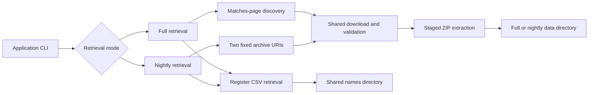

# Requirements

### Overview & Goals
Add a `--nightly`/`-n` retrieval mode to `bbb-get-cricsheet-data` for scheduled partial refreshes without changing the existing full-download behavior.

### Functional Requirements
- `--nightly` is an exclusive workflow selector; it does not discover or download the full archive set.
- Download exactly these fixed HTTPS sources, sequentially and in this order:
  1. `https://cricsheet.org/downloads/recently_added_7_json.zip`
  2. `https://cricsheet.org/downloads/recently_added_2_json.zip`
- Store nightly ZIPs in `[base directory]/[data directory]/zips`.
- Extract both archives directly into `[base directory]/[data directory]/`, without archive-named subdirectories or an implicit `nightly` path segment.
- Process `recently_added_7_json.zip` before `recently_added_2_json.zip`; if both contain the same relative file, the second archive overwrites the first.
- Always download and validate `people.csv` and `names.csv` using the existing register sources. Full mode uses `[base directory]/[names directory]`; nightly mode stores them alongside the nightly JSON in `[base directory]/[data directory]`.
- Nightly mode may reuse existing target directories and always replaces managed ZIP, extracted, and CSV files. It preserves stale/unrelated files and rejects destination paths that are regular files.
- Existing `--force`/`-f` remains accepted in nightly mode as a harmless no-op.
- Preserve existing retry, atomic-download, ZIP-safety, CSV-validation, continue-and-report, logging, and exit-code behavior. Nightly attempts remaining archives and CSVs after an individual failure and returns `1` for any operational failure.
- Preserve the current full mode, including archive discovery, archive-named extraction directories, and its existing preflight semantics.

### Scope
**In scope:** CLI parsing, nightly path resolution, fixed-source retrieval, flat staged extraction, overwrite ordering, regression tests, and contributor documentation.

**Out of scope:** new dependencies, changes to Cricsheet’s source data, deletion of stale nightly files, concurrent downloads, or changes to the full retrieval workflow.

# Technical Design

### Current Implementation
- `bbb-get-cricsheet-data/src/main/kotlin/com/knowledgespike/ballbyball/getcricsheetdata/Application.kt` parses the existing Commons CLI command and constructs the retrieval configuration.
- `CricsheetDataRetriever.kt` currently discovers `_json.zip` links from the matches page, downloads them through the injected JDK HTTP transport, validates/stages ZIPs, commits extracted files, and downloads the register CSVs.
- Full-mode extraction currently creates an archive-specific directory such as `data/bbl_json`; nightly mode must bypass that directory wrapper.
- `CommandLineArgumentsTest.kt` and `CricsheetDataRetrieverTest.kt` are the established parser and deterministic local HTTP/ZIP test seams.
- The module already uses JDK 21, Jsoup, Commons CLI, and the version catalog; no dependency change is needed.

### Proposed Changes
- Extend the parsed run command with an explicit nightly mode value/flag while retaining required absolute `bd`, safe relative `dd`, optional `nd`, and `-f`/`--force` behavior.
- Resolve the effective archive data directory centrally to `[bd]/[dd]` in both modes. Full mode keeps register output at `[bd]/[nd]`; nightly mode uses the effective data directory for register output as well.
- Add fixed nightly archive URIs to the Cricsheet source configuration. The nightly branch must not fetch or parse the downloads page.
- Reuse the existing downloader, retry policy, atomic temporary-file replacement, ZIP validation, safe-entry validation, logging, CSV validation, and failure aggregation.
- Add a nightly archive processing path that stages entries without an archive-name child directory, commits them to the nightly data directory, and runs the two archives in the fixed `7`, then `2` order.
- Keep CSV processing independent and execute it for both full and nightly modes.
- Adjust preflight directory handling so nightly can create or reuse its data directory for archives, extracted files, and registers, while regular-file conflicts remain failures.

### Architecture Diagram

### Key Decisions
- Use a mode branch inside the existing `CricsheetDataRetriever`, rather than a new module or independent application, because both workflows share transport, artifact validation, CSV retrieval, logging, and failure aggregation.
- Represent the nightly archive list as an explicit ordered collection, not a discovered/sorted set, so the required `7`-before-`2` overwrite precedence is visible and testable.
- Keep staging and ZIP-slip validation for nightly extraction; only the destination layout changes from archive-specific directories to a flat merge.
- Treat `--nightly` as the overwrite permission for nightly directories; accept `--force` for script compatibility but do not require it.

### Files and Tests
- Modify `bbb-get-cricsheet-data/src/main/kotlin/com/knowledgespike/ballbyball/getcricsheetdata/Application.kt` for the new option and mode-aware configuration.
- Modify `bbb-get-cricsheet-data/src/main/kotlin/com/knowledgespike/ballbyball/getcricsheetdata/CricsheetDataRetriever.kt` for effective path resolution, fixed sources, ordered nightly processing, and flat extraction.
- Extend `bbb-get-cricsheet-data/src/test/kotlin/com/knowledgespike/ballbyball/getcricsheetdata/CommandLineArgumentsTest.kt` for `-n`/`--nightly`, compatibility with `-f`, and unchanged full-mode validation.
- Extend `bbb-get-cricsheet-data/src/test/kotlin/com/knowledgespike/ballbyball/getcricsheetdata/CricsheetDataRetrieverTest.kt` with local ZIP fixtures that prove fixed request order, nightly paths, direct extraction, collision precedence, CSV reuse, directory reuse, stale-file preservation, and continuation after a failed archive.
- Update `README-DEV.md`, `docs/architecture/applications.md`, and `docs/project_memory.md` with the nightly command, layout, mode distinction, and operational decisions.

# Testing

### Validation Approach
Use the existing JUnit 5, Strikt, and injected local HTTP transport seams. Do not call the live Cricsheet site from tests.

### Key Scenarios
- Parse both `-n` and `--nightly` and confirm full-mode arguments remain backward compatible.
- Run nightly retrieval against local fixtures and verify requests occur as `recently_added_7_json.zip`, `recently_added_2_json.zip`, `people.csv`, then `names.csv`.
- Verify ZIPs, extracted JSON, `people.csv`, and `names.csv` are stored directly under `[bd]/[dd]` (with ZIPs in its `zips` child), not below an implicit `nightly` or archive-named directory.
- Use overlapping ZIP fixtures to prove the second archive overwrites the first archive’s same-path file.
- Verify existing nightly directories work without `--force`, managed files are replaced, stale files remain, and `-n -f` is accepted.
- Verify a failed first archive does not prevent the second archive or either CSV from being attempted and produces a non-zero result.
- Verify existing full-mode tests still assert archive-named extraction and current directory/force behavior.

### Edge Cases
- Reject absolute or traversal-escaping `dd`/`nd` values using existing validation.
- Reject regular files where the nightly data, nightly `zips`, register files, or required parent path must be directories.
- Preserve atomic download and staged extraction guarantees when replacing existing artifacts.
- Run `./gradlew :bbb-get-cricsheet-data:test --no-daemon`, `./gradlew clean check --no-daemon`, and `git diff --check` after implementation.

# Delivery Steps

### ✓ Step 1: Add nightly CLI mode and path resolution
The command accepts `-n`/`--nightly` and resolves nightly archive destinations without changing full-mode arguments.

- Update `Application.kt` and its command model to carry the nightly mode.
- Preserve required absolute base and safe relative data/name directory validation.
- Resolve nightly archives to `[bd]/nightly/[dd]` while keeping CSVs at `[bd]/[nd]`.
- Accept `-f`/`--force` alongside nightly as a no-op.
- Add parser tests for both aliases, mode compatibility, and path validation.

### ✓ Step 2: Implement ordered nightly downloads and CSV reuse
Nightly retrieval downloads the two fixed archives in `7`-then-`2` order and still refreshes both register CSVs.

- Add fixed nightly source URIs to `CricsheetDataRetriever` configuration.
- Bypass downloads-page discovery in nightly mode.
- Reuse the existing sequential HTTP transport, retry, atomic replacement, validation, logging, and failure aggregation.
- Allow nightly target directories to be created or reused while rejecting regular-file conflicts.
- Add deterministic local HTTP tests for source selection, request order, destination paths, CSV reuse, and continuation after failures.

### ✓ Step 3: Implement flat staged nightly extraction
Nightly ZIP contents are safely merged directly into the nightly data directory with later archive content winning collisions.

- Add a nightly extraction path that stages validated entries without an archive-name directory.
- Commit `recently_added_7_json.zip` before `recently_added_2_json.zip` so the latter overwrites same-relative-path files.
- Preserve ZIP-slip protection, corrupt-archive rejection, stale-file preservation, and atomic/staged final-state guarantees.
- Add overlapping-fixture tests for flat layout, overwrite precedence, existing-directory reuse, and stale files.
- Run the module tests and full `clean check` validation.

### ✓ Step 4: Document the nightly workflow
Contributor documentation describes how to run and reason about full versus nightly retrieval.

- Update `README-DEV.md` with the nightly command, flags, output layout, overwrite behavior, and CSV location.
- Update `docs/architecture/applications.md` with the mode-specific retrieval flow and destination semantics.
- Add the completed nightly task, decisions, gotchas, and test coverage to `docs/project_memory.md`.
- Confirm formatting and repository diff checks pass.

### ✓ Step 5: Remove the implicit nightly directory from retrieval
Nightly archives and register CSVs use the configured data directory directly, without an implicit `nightly` path segment; full-mode behavior remains unchanged.

- Resolve nightly archive ZIPs and flat extracted JSON under `[bd]/[dd]`.
- Store nightly `people.csv` and `names.csv` alongside the extracted JSON under `[bd]/[dd]`.
- Preserve nightly reuse, overwrite, collision ordering, stale-file preservation, and regular-file rejection.
- Update parser and retriever tests plus contributor and architecture documentation for the revised layout.
- Run the retrieval module tests and `git diff --check`.

### ✓ Step 6: Remove directory metadata dependency from updater
`bbb-update-database` accepts the downloader’s base/data/names path contract and a nightly mode, with generated output paths resolved relative to the base directory.

- Replace manual base-directory string concatenation with a validated importer configuration.
- Resolve full and nightly JSON input from `[bd]/[dd]`, scanning JSON files without relying on archive-named directories.
- Resolve the player registry from `[bd]/[nd]` in full mode and from the effective nightly data directory in nightly mode.
- Add `-n`/`--nightly` and preserve existing output/database options.
- Resolve `-o`/`--outputFile` and `-sf`/`--sqlFile` beneath `[bd]`.
- Derive competition and gender-aware warehouse match-type metadata from every JSON document, removing the hard-coded `cardDirectories` mapping.

### ✓ Step 7: Test nightly database imports
The updater has deterministic coverage for command parsing, path resolution, flat nightly input, metadata mapping, and full-mode compatibility.

- Add parser/configuration tests for full and nightly path resolution and safe relative directories.
- Add importer tests proving nightly scans flat JSON files only and does not require archive-named directories.
- Add metadata tests for event fallback, source match-type mapping, and women’s match types.
- Preserve and run existing adapter/database tests.

### ✓ Step 8: Document and validate the updater workflow
Contributor and architecture documentation explain how retrieval and database update commands compose.

- Document full versus nightly updater commands and input layouts.
- Record the updater decisions and gotchas in `docs/project_memory.md`.
- Run the updater tests, full `clean check`, and `git diff --check`.

### ✓ Step 9: Resolve CSV output beneath the base directory
`bbb-update-database` resolves `-cd`/`--csvDir` relative to the configured base directory, matching SQL output path handling.

- Reuse the validated relative-path resolver for CSV output.
- Reject absolute and traversal-escaping CSV output paths.
- Add parser/configuration regression coverage and update contributor documentation.