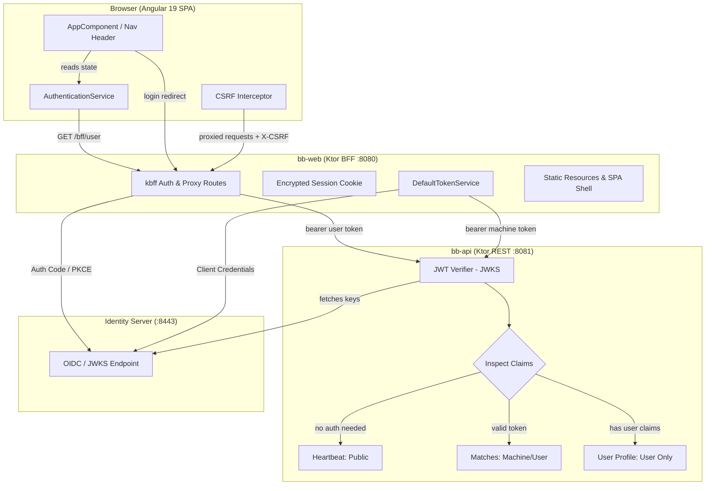

# Requirements

### Overview & Goals
Introduce secure authentication and authorization across the BallByBall application suite (`bb-api`, `bb-web`, and the Angular client), adopting the Backend-for-Frontend (BFF) architecture pattern established in `acs-web` and `acs-api`.

The solution connects to the shared Identity Server (`ids.local:8443` or configured OIDC authority) with dedicated client credentials. It provides three distinct levels of API access, secure cookie-based session handling, and real-time reactive user authentication state in the Angular front end.

### Scope
- **In Scope**:
  - `bb-api`: JWT verification via OIDC JWKS, distinguishing between unauthenticated, machine-authenticated (client credentials), and human user-authenticated endpoints.
  - `bb-api`: Addition of public `/api/heartbeat/alive`, securing `/api/matches` for machine access, and addition of user-protected `/api/user/profile`.
  - `bb-web`: Integration of the `kbff` library for BFF login (`/bff/login`), callback (`/signin-oidc`), logout (`/bff/logout`), session claims (`/bff/user`), and CSRF-protected proxying.
  - `bb-web`: Machine-to-machine `TokenService` using client credentials grant to call `bb-api` when no user is logged in.
  - Angular (`bb-web/ClientApp`): Reactive `AuthenticationService`, CSRF/credentials HTTP interceptor, and dynamic navigation header rendering login/logout states.
  - Configuration: Environment variables and YAML configurations for both services (`.env`, `.env.example`, `application.yaml`).
- **Out of Scope**:
  - Modifying the external Identity Server implementation or schema.
  - Database-level user management (all identity and authentication is delegated to the external OIDC provider).

### User Stories
- **As an anonymous visitor**:
  - I can view recent matches and front-page content without logging in because `bb-web` securely fetches data from `bb-api` using an application token.
  - I can click "Sign In" in the header to authenticate with the Identity Server.
- **As an authenticated user**:
  - I can log in via OIDC authorization code flow with PKCE, receive a secure HTTP-only session cookie, and see my name and avatar in the application header.
  - I can access protected endpoints (such as `/api/user/profile`) through the BFF proxy.
  - I can click "Sign Out" to terminate my session on both `bb-web` and the Identity Server.
- **As a monitoring system**:
  - I can query `/api/heartbeat/alive` on `bb-api` without credentials to verify service liveness.

### Functional Requirements
- **FR-1: API Access Tiers**:
  - *Tier 1 (Unauthenticated)*: `/api/heartbeat/alive` must respond with HTTP `200 OK` and `{ "message": "Heartbeat: Alive" }` without requiring any credentials.
  - *Tier 2 (Machine / BFF Authenticated)*: `/api/matches` must require a valid JWT with appropriate scope (e.g. `bb.api.read` or `acs.api.read`). Accessible by `bb-web` via client credentials even when no human user is logged in.
  - *Tier 3 (User Authenticated)*: `/api/user/profile` must require a valid JWT containing a human user subject claim (`sub`) and role, returning `401 Unauthorized` if missing credentials or `403 Forbidden` if called with a machine-only token.
- **FR-2: BFF Authentication Flow**:
  - `bb-web` must expose `/bff/login`, redirecting to the Identity Server with PKCE parameters.
  - `bb-web` must handle the `/signin-oidc` callback, exchanging the authorization code for tokens, encrypting them in a secure server-side session cookie (`bb_session`).
  - `bb-web` must expose `/bff/user`, returning current user claims and `bff:logout_url`.
  - `bb-web` must expose `/bff/logout`, clearing local session cookies and redirecting to the Identity Server end-session endpoint.
- **FR-3: Machine Token Service**:
  - `bb-web` must implement `TokenService` to request and cache client-credentials tokens from the Identity Server for background or anonymous API calls.
- **FR-4: CSRF & Proxy Security**:
  - Any proxied request under `/api/*` from the browser must require the `X-CSRF: 1` header to prevent cross-site request forgery.
- **FR-5: Angular UI Integration**:
  - The header must dynamically display a "Sign In" action when unauthenticated and user details + "Sign Out" when authenticated.

### Non-Functional Requirements
- **Security**: Access and refresh tokens must never be exposed to browser JavaScript; all tokens are stored in HTTP-only, secure, SameSite cookies managed by `kbff`.
- **Resilience**: Client credentials tokens must be cached in-memory and refreshed before expiry to minimize latency and token endpoint load.
- **Compatibility**: Environment variables must provide zero-config development defaults for `ids.local:8443` while allowing override in containerized or CI environments.

# Technical Design

### Current Implementation
- `bb-api`: Uses Ktor with Netty, HikariCP, and JOOQ. Routes in `ApiRoutes.kt` are currently unauthenticated (`/health` and `/api/matches`). No security or authentication plugins are installed.
- `bb-web`: Uses Ktor with Netty, serving an Angular 19 SPA via `singlePageApplication` and proxying match requests via `KtorMatchApiClient`. No session management, OIDC integration, or `kbff` routes exist.
- `bb-web/ClientApp`: Standalone Angular 19 application with signals and Tailwind CSS. The header in `app.component.html` contains a hardcoded static user display (`kevin@knowledgespike.com`).

### Key Decisions
- **Decision 1: Claim Inspection for User vs. Machine Tokens**:
  - *Approach*: A single Ktor JWT authentication provider verifies the token signature against the JWKS endpoint. Route authorization inspects claims (`sub` format and presence of user role claims) to differentiate machine tokens from logged-in user tokens.
  - *Rationale*: Avoids redundant verifier chains while strictly preventing machine tokens from calling user-restricted endpoints.
- **Decision 2: Backend-for-Frontend (BFF) Pattern using `kbff`**:
  - *Approach*: Use `com.knowledgespike:kbff` (0.4.1) in `bb-web` for session encryption, OIDC authorization code flow with PKCE, and anti-CSRF proxying.
  - *Rationale*: Matches the proven pattern in `acs-web`, keeps access tokens out of the browser DOM/storage, and provides seamless Single Page Application integration.
- **Decision 3: Dedicated Machine Token Service**:
  - *Approach*: Implement `DefaultTokenService` in `bb-web` using Ktor HTTP client to acquire client credentials tokens for unauthenticated front-page calls.
  - *Rationale*: Allows `bb-api` to keep all data endpoints protected against raw public access while allowing `bb-web` to render public data like recent matches.

### Architecture Diagram



### Proposed Changes

#### 1. `gradle/libs.versions.toml`
- Add `kbff-version = "0.4.1"` and `knowledgespike-kbff = { module = "com.knowledgespike:kbff", version.ref = "kbff-version" }`.
- Add `nimbus-jwt-version = "10.9"` and `nimbus-oidc-version = "11.37.1"`.
- Add `com.auth0:jwks-rsa:0.22.1`.
- Add Ktor server auth and JWT libraries (`ktor-server-auth`, `ktor-server-auth-jwt`, `ktor-server-sessions`).

#### 2. `bb-api`
- Update `application.yaml`, `.env`, and `.env.example`:
  ```yaml
  jwt:
    jwksUrl: "${JWT_JWKS_URL:https://ids.local:8443/.well-known/openid-configuration/jwks}"
    issuer: "${JWT_ISSUER:https://ids.local:8443}"
    realm: "${JWT_REALM:Access to BallByBall API}"
    audience: "${JWT_AUDIENCE:bb.api}"
  ```
- Add `Security.kt` (`com.knowledgespike.ballbyball.api.bootstrap.Security.kt`):
  - Configures `authentication { jwt("auth-jwt") { ... } }` with `JwkProviderBuilder`.
  - Implements `requireUserPrincipal()` route extension that verifies `sub` claim and user roles.
- Update `ApiRoutes.kt`:
  - `routeHeartbeat()`: Public `/api/heartbeat/alive` returning `{"message": "Heartbeat: Alive"}`.
  - `routeMatches()`: Authenticated (`auth-jwt`), accessible with machine or user token.
  - `routeUser()`: Authenticated (`auth-jwt`), verifies `requireUserPrincipal()`, returns user profile details.

#### 3. `bb-web`
- Update `application.yaml`, `.env`, and `.env.example`:
  ```yaml
  kbff:
    oidc:
      authority: "${OIDC_AUTHORITY:https://ids.local:8443}"
      clientId: "${OIDC_CLIENT_ID:bbweb}"
      clientSecret: "${OIDC_CLIENT_SECRET:secret}"
      scopes: ["openid", "profile", "bb.api", "bb.api.read"]
      redirectUri: "${OIDC_REDIRECT_URI:http://localhost:8080/signin-oidc}"
      postLogoutRedirectUri: "${OIDC_POST_LOGOUT_REDIRECT_URI:http://localhost:8080/}"
    api:
      baseUrl: "${API_BASE_URL:http://localhost:8081}"
  ```
- Implement `DefaultTokenService`:
  - Queries `$authority/.well-known/openid-configuration` to find `token_endpoint`.
  - Executes `client_credentials` grant flow, caches access token with expiration buffer.
- Update `WebModule.kt`:
  - Install Ktor sessions with cookie encryption.
  - Install `installKbffSecurityHeaders(bffConfig)`.
  - Register `kbffAuthRoutes` (`/bff/login`, `/signin-oidc`, `/bff/user`, `/bff/logout`).
  - Register `kbffProxyRoutes` proxying `/api` to `bb-api`.
- Update `KtorMatchApiClient` to use `TokenService` for bearer authentication on outbound requests.

#### 4. `bb-web/ClientApp` (Angular)
- Add `AuthenticationService` (`src/app/services/authentication.service.ts`):
  - Manages session state via `http.get<Session>('/bff/user')`.
  - Computes signals: `isAuthenticated`, `isAnonymous`, `userName`, `email`, `logoutUrl`.
- Add `CsrfInterceptor` (`src/app/interceptors/csrf.interceptor.ts`):
  - Injects `X-CSRF: 1` header on modifying or proxied API requests.
- Update `app.component.html` and `app.component.ts`:
  - Replace static user mock with `@if (authService.isAuthenticated())` rendering user name and Sign Out button.
  - Render "Sign In" link (`href="/bff/login"`) when unauthenticated.

### File Structure Changes
```text
bb-api/
  src/main/kotlin/.../api/
    bootstrap/
      Security.kt                [NEW: JWT configuration & claim validator]
    adapter/in/http/
      HeartbeatRoute.kt          [NEW: public unauthenticated endpoint]
      UserRoute.kt               [NEW: user-only authenticated endpoint]
      ApiRoutes.kt               [UPDATED: auth wrapping for matches]
bb-web/
  src/main/kotlin/.../web/
    domain/service/
      TokenService.kt            [NEW: token service interface]
    adapter/out/service/
      DefaultTokenService.kt     [NEW: client_credentials token fetcher]
    bootstrap/
      WebModule.kt               [UPDATED: kbff sessions, auth, proxy routes]
  ClientApp/src/app/
    services/
      authentication.service.ts  [NEW: Angular reactive auth signal service]
      authentication.service.spec.ts [NEW: unit tests]
    interceptors/
      csrf.interceptor.ts        [NEW: X-CSRF and withCredentials interceptor]
    app.component.html           [UPDATED: dynamic header auth controls]
    app.component.ts             [UPDATED: injects AuthenticationService]
```

### Risks & Mitigations
- **Self-signed SSL certificates in development (`ids.local:8443`)**:
  - *Risk*: Ktor or JVM fails with SSL handshake exception when connecting to local Identity Server.
  - *Mitigation*: Support `sslCertificatePath` or development trust manager helper (similar to `configureTrustForDevelopment` in `acs-web`).
- **Token Expiry During Proxy Requests**:
  - *Risk*: User access token expires while using the SPA.
  - *Mitigation*: `kbff` automatically handles refresh token exchange during proxy calls when offline access is configured.
- **CSRF Mismatch**:
  - *Risk*: Direct browser AJAX calls to `/api/*` rejected with 400/403.
  - *Mitigation*: Global Angular HTTP interceptor automatically appends `X-CSRF: 1` header.

# Testing

### Validation Approach
Verification follows automated testing at each layer:
1. **API Layer (`bb-api`)**:
   - Unit and integration tests using `ktor-server-test-host` with mock JWT generation to verify access controls on all three endpoint types.
2. **Web / BFF Layer (`bb-web`)**:
   - Tests in `WebModuleTest` verifying `DefaultTokenService` caching and error handling, session cookie handling, and proxy header forwarding.
3. **Frontend Layer (`bb-web/ClientApp`)**:
   - Karma Jasmine unit tests verifying `AuthenticationService` signals and `AppComponent` header rendering under authenticated and unauthenticated scenarios.
4. **Build Verification**:
   - Complete `./gradlew check` across all modules.

### Key Scenarios
- **Scenario 1: Unauthenticated Liveness Check**:
  - `GET /api/heartbeat/alive` on `bb-api` returns `200 OK` with JSON `{ "message": "Heartbeat: Alive" }` with no headers provided.
- **Scenario 2: Machine Access to Front Page / Matches**:
  - `GET /api/matches` without token returns `401 Unauthorized`.
  - `GET /api/matches` with valid machine token returns `200 OK` and match list.
  - `GET /api/matches` via `bb-web` succeeds for anonymous browser visitors using the cached machine token from `DefaultTokenService`.
- **Scenario 3: User-Protected Route Access**:
  - `GET /api/user/profile` without token returns `401 Unauthorized`.
  - `GET /api/user/profile` with machine token returns `403 Forbidden`.
  - `GET /api/user/profile` with valid user token returns `200 OK` with user profile details.
- **Scenario 4: BFF Authentication Lifecycle**:
  - Navigating to `/bff/login` initiates OIDC authorization redirect with PKCE challenge.
  - Receiving `/signin-oidc` sets secure encrypted session cookie.
  - Calling `/bff/user` with session cookie returns user claims and logout URL.
  - Accessing `/bff/logout` invalidates session and redirects to post-logout endpoint.

### Edge Cases
- Expired or malformed JWT bearer token returns HTTP `401 Unauthorized`.
- Token signed by an untrusted issuer or with wrong audience returns HTTP `401 Unauthorized`.
- Proxied `/api/*` call missing `X-CSRF` header returns HTTP `400 Bad Request`.
- OIDC Identity Server unavailable during token refresh returns structured `502 Bad Gateway` or `500 Internal Server Error`.

### Test Changes
- `bb-api/src/test/kotlin/com/knowledgespike/ballbyball/api/ApiModuleTest.kt`:
  - Add tests for `/api/heartbeat/alive` (no auth).
  - Add tests for `/api/matches` (unauthenticated 401 vs. authorized 200).
  - Add tests for `/api/user/profile` (machine token 403 vs. user token 200).
- `bb-web/src/test/kotlin/com/knowledgespike/ballbyball/web/WebModuleTest.kt`:
  - Add tests for `DefaultTokenService` mock token acquisition.
  - Add tests for `/bff/user` anonymous vs. session states.
- `bb-web/ClientApp/src/app/services/authentication.service.spec.ts`:
  - Test `isAnonymous()` signal when `/bff/user` returns 401/null.
  - Test `isAuthenticated()` and `userName()` when `/bff/user` returns session claims.
- `bb-web/ClientApp/src/app/app.component.spec.ts`:
  - Verify "Sign In" link is rendered when unauthenticated.
  - Verify user name and "Sign Out" button are rendered when authenticated.

# Delivery Steps

### ✓ Step 1: Configure OIDC and JWT Authentication in bb-api
`bb-api` validates JWT bearer tokens from the OIDC authority and exposes unauthenticated, machine-accessible, and user-authenticated endpoints.

- Add `ktor-server-auth`, `ktor-server-auth-jwt`, and `com.auth0:jwks-rsa` dependencies to `gradle/libs.versions.toml` and `bb-api/build.gradle.kts`.
- Configure JWT settings (`jwksUrl`, `issuer`, `realm`, `audience`, `leeway`) in `bb-api/src/main/resources/application.yaml` and `bb-api/.env` / `bb-api/.env.example`.
- Implement `configureSecurity` in `bb-api` to register Ktor JWT authentication verifying tokens against the JWKS endpoint.
- Implement claim inspection logic (`requireUserPrincipal` / user claim validation) to differentiate machine/client-credentials tokens from human user tokens (checking for user `sub` and roles).
- Add the public unauthenticated `/api/heartbeat/alive` route returning status `{"message": "Heartbeat: Alive"}`.
- Secure `/api/matches` with JWT authentication so it is accessible with a machine token (or user token).
- Implement the user-protected route `/api/user/profile` that rejects machine-only tokens and returns profile data when a user token is provided.
- Add unit and integration tests in `ApiModuleTest` verifying:
  - `/api/heartbeat/alive` succeeds without token.
  - `/api/matches` rejects unauthenticated requests and succeeds with valid machine token.
  - `/api/user/profile` returns `401 Unauthorized` without token, `403 Forbidden` with machine token, and `200 OK` with user token.

### ✓ Step 2: Integrate kbff and TokenService in bb-web
`bb-web` handles BFF session management, client-credentials token caching, OIDC login/logout workflows, and CSRF-protected proxying to `bb-api`.

- Add `knowledgespike-kbff` (0.4.1), Nimbus OIDC SDK, and Ktor session/auth dependencies to `gradle/libs.versions.toml` and `bb-web/build.gradle.kts`.
- Add OIDC and BFF configuration keys (`kbff.oidc.*`, `kbff.api.*`, `kbff.proxy.*`) to `bb-web/src/main/resources/application.yaml` and `bb-web/.env` / `bb-web/.env.example`.
- Implement `DefaultTokenService` in `bb-web` to acquire and cache client-credentials tokens from the Identity Server token endpoint.
- Configure `kbff` session management, cookie encryption, security headers, and authentication in `bb-web/src/main/kotlin/com/knowledgespike/ballbyball/web/bootstrap/WebModule.kt`.
- Register `kbffAuthRoutes` (`/bff/login`, `/signin-oidc`, `/bff/user`, `/bff/logout`, `/signout-callback-oidc`) and `kbffProxyRoutes` with CSRF protection (`X-CSRF: 1`).
- Update `KtorMatchApiClient` (or machine route handlers) to inject the bearer token obtained from `TokenService` when querying `bb-api`.
- Add tests in `WebModuleTest` verifying token retrieval, login redirection, session cookie handling, and proxy header forwarding.

### ✓ Step 3: Implement Angular Authentication State and UI Controls
The Angular application manages reactive authentication state and renders dynamic login/logout and user profile controls in the navigation header.

- Implement `AuthenticationService` (`ClientApp/src/app/services/authentication.service.ts`) using Angular signals (`session`, `isAuthenticated`, `isAnonymous`, `userName`, `email`, `logoutUrl`) by querying `/bff/user`.
- Implement an HTTP interceptor (`ClientApp/src/app/interceptors/csrf.interceptor.ts`) that appends `withCredentials: true` and the required `X-CSRF: 1` header to API and BFF requests.
- Update `app.component.html` and `app.component.ts` header to replace the hardcoded user badge with dynamic auth controls:
  - When anonymous: render a "Sign In" link targeting `/bff/login`.
  - When authenticated: render user avatar, name, and "Sign Out" link using `logoutUrl()`.
- Add a user profile display component or section to demonstrate fetching `/api/user/profile` while authenticated.
- Add Karma unit tests in `ClientApp/src/app/services/authentication.service.spec.ts` and `app.component.spec.ts` testing authenticated and unauthenticated states.

### ✓ Step 4: End-to-End Verification and Architecture Documentation
The end-to-end authentication and authorization workflow is validated across services and documented in repository architecture records.

- Verify the end-to-end flow: unauthenticated heartbeat call, machine-authenticated matches fetch, BFF login flow, and user-authenticated profile retrieval.
- Update `docs/architecture/applications.md` with the three-tier authentication model, BFF request flows, and token security boundaries.
- Update `docs/project_memory.md` documenting decisions, library selections (`kbff`), and environment configurations.
- Run `./gradlew check` across all modules (`bb-shared`, `bb-update-database`, `bb-api`, `bb-web`) and Angular Karma tests to ensure 100% clean build.