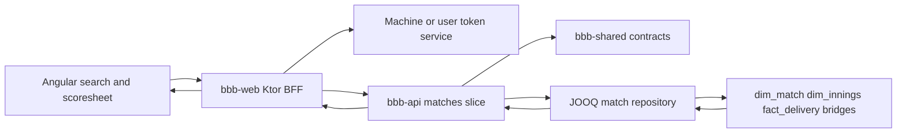

# Requirements

### Deliverables
Create exactly two planned, linked Markdown documents; do not implement code, change migrations, or mark tasks complete:

- `docs/sprints/bbb-sprint-1-historical-match-scoresheet.md`
- `docs/tasks/bbb-tasks-sprint-1-historical-match-scoresheet.md`

Because this repository currently has no `docs/sprints` or `docs/tasks` numbering baseline, establish Sprint 1 as the initial convention and mark it `planned`.

### Sprint specification contents
The sprint document will cover:

- Goal and baseline: current protected recent-match flow (`GET /api/matches?limit=...`), shared `Envelope`/`MatchSummary`, BFF `MatchApiClient`, and empty Angular route table.
- User journey: historical search → idle/loading/results/no-results/error → exactly-one match selection → direct selected-match route → historical innings and delivery-by-delivery scoresheet → back to results.
- In scope: completed/historical data only, search results, selected-match detail, innings sections, deterministic delivery rows, incomplete-data messaging, responsive/accessibility behavior, API/BFF/shared contracts, tests, ADR/documentation follow-up.
- Explicitly out of scope: live status, polling, real-time controls, in-progress sections, unsupported visual-reference metrics, speculative external links/exports, migrations unless discovery proves a schema gap.
- Functional and non-functional requirements for loading, empty, error, 404, missing/incomplete scorecard, large searches/matches, pagination, keyboard navigation, responsive tables, and stable ordering.
- Measurable acceptance criteria and definition of done, including end-to-end search-to-selection-to-score-sheet navigation and direct/back navigation.

### HITL choices recorded with proposed defaults
The sprint document will make unresolved decisions explicit rather than silently inventing behavior:

- **Search filters:** proposed default is a bounded free-text query over verified match identity fields, with optional structured team/date/type filters only after warehouse/query discovery; ACS-style team/opponent/date/type/result semantics remain a review choice.
- **Historical eligibility:** proposed default is an API-defined historical record with `dim_match` metadata and available delivery/innings data; `victory_type` values such as tie, draw, or no result are not treated as live status and require product confirmation.
- **Score detail:** proposed default is match context + innings + raw delivery rows and available wicket/fielder associations; batting/bowling aggregates, dismissal identities, fall-of-wickets, partnerships, projections, and “verified” claims are deferred unless proven by warehouse data.
- **Pagination:** proposed default is bounded, deterministic search pagination and innings/delivery pagination or chunking for large matches, with exact cursor/limit semantics approved before implementation.
- **Links:** proposed default is no external original-scan/download link unless a stable, approved source URL exists.
- **API boundary:** separate search and detail endpoints are selected, preserving recent-match compatibility.

### Future documentation follow-up
The task document will include unchecked future tasks for `docs/architecture/applications.md` if module/runtime boundaries change, `README.md`, `docs/project_memory.md`, and an ADR for the separate endpoint/order/completion decisions. These are implementation-sprint tasks, not changes made now.

# Technical Design

### Current implementation and verified references

- `bbb-api/src/main/kotlin/.../feature/matches/presentation/MatchesRoute.kt` authenticates `GET /api/matches` and validates `days`/`limit` with Arrow `fold`.
- `bbb-api/src/main/kotlin/.../feature/matches/domain/{repository,service}` and `.../data/repository/JooqMatchRepository.kt` are the existing feature-slice seams; `ApiModule.kt` wires `MatchRepository`, `MatchService`, and `routeMatches`.
- `bbb-shared/src/main/kotlin/.../contracts/ApiContracts.kt` defines `Envelope` payload contracts including `MatchSummary` and `RecentMatchesResponse`; new contracts belong here and keep value-class serialization transparent.
- `bbb-web/src/main/kotlin/.../application/MatchApiClient.kt`, `adapter/out/api/KtorMatchApiClient.kt`, and `adapter/in/http/WebRoutes.kt` form the typed BFF client/proxy path and currently expose recent matches only.
- `bbb-web/ClientApp/src/app/services/match.service.ts`, `models/match.model.ts`, `app.component.ts`, and empty `app.routes.ts` are the current Angular seams; standalone routed components and query/path parameters should be confirmed in the task discovery slice.
- `docs/architecture/applications.md`, `docs/architecture/database.md`, `bbb-update-database/migrations/mysql/2__initial_warehouse.sql`, ACS `GetScorecardListComponent`/`FindScorecard`/`GetCardByIdComponent`, and `bbb-web/design/stitch_cricket_scorecard_explorer/{DESIGN.md,code.html}` are cited as evidence and inspiration, not as contracts.

### Proposed contracts and flow
Use separate protected endpoints, shared typed contracts, and preserve the existing recent route:

- `GET /api/matches/search?...` (exact filter set, page size, and cursor are HITL-approved) returns an envelope containing bounded `MatchSummary` results and pagination metadata.
- `GET /api/matches/{matchKey}/scoresheet?...` returns an envelope containing selected-match context, innings summaries, delivery rows, completeness indicators, and optional supported wicket/fielder details.
- Keep `GET /api/matches?limit=...` behavior backward-compatible; do not overload its recent-match response with delivery data.
- Add corresponding BFF paths under `/api`, with `KtorMatchApiClient` methods using `TokenService` and mapping non-2xx/network/malformed responses to the existing unavailable result model.
- Angular routes should preserve search criteria/results in query parameters where practical and use a typed match-key route for direct navigation; back-to-results restores the prior search state when available.

### Warehouse query and mapping rules
The task document will require discovery-backed queries before implementation:

- Search joins `dim_match` to `dim_team`, `dim_ground`, `dim_date`, and optionally `fact_match`, using indexed identity/type/season/date/team columns and deterministic result tie-breakers (`match_start_date_key`/stable match key as appropriate).
- Scoresheet joins `dim_match` → `dim_innings` → `fact_delivery`, with `dim_person` for batter/non-striker/bowler names.
- Wicket information is loaded through `bridge_delivery_wicket`/`dim_wicket`, and fielders through `bridge_delivery_fielder`; aggregation must prevent bridge joins from duplicating delivery rows.
- Delivery order is explicitly deterministic: innings number/order, `innings_order`, `over_number`, `ball_in_over`, `ball_number`, then `delivery_key` as a stable tie-breaker. The UI must display source labels and extras without assuming every repeated label is a legal ball or that over/ball alone is unique.
- Missing rows, nullable match/date/wicket values, multiple wickets on one delivery, incomplete innings, and absent `fact_match` rows produce explicit completeness metadata/messages rather than fabricated statistics.

### Components and files to plan

- `bbb-shared/.../contracts/ApiContracts.kt`: search request/filter and page contracts, scoresheet/innings/delivery contracts, completeness/error-safe fields.
- `bbb-api/.../feature/matches/domain`: extend repository/service ports with validated tiny types and use-case methods for search and scoresheet detail.
- `bbb-api/.../feature/matches/presentation/MatchesRoute.kt`: boundary validation with Arrow `fold`/`zipOrAccumulate`, 400/404 mapping, protected route wiring.
- `bbb-api/.../feature/matches/data/repository/JooqMatchRepository.kt`: indexed search/detail queries, row mappers, deterministic ordering, bridge aggregation, logging and IO dispatcher use.
- `bbb-api/.../bootstrap/ApiModule.kt`: only route/service registration changes proven necessary by the feature slice.
- `bbb-web/.../application/MatchApiClient.kt`, `adapter/out/api/KtorMatchApiClient.kt`, `adapter/in/http/WebRoutes.kt`: separate typed BFF operations, machine/user token forwarding, stable browser-facing error envelopes.
- `bbb-web/ClientApp/src/app/models`, `services/match.service.ts`, and routed feature components under a confirmed Angular feature directory: search form/results, selected-match scoresheet, loading/error/empty/incomplete states, semantic table markup, keyboard/focus behavior, and route navigation.
- `bbb-web/design/stitch_cricket_scorecard_explorer`: use the visual hierarchy and linear matrix treatment while excluding illustrative live/projection/export/verification content.
- `docs/architecture/applications.md`, `README.md`, `docs/project_memory.md`, and a new ADR: future updates only after implementation changes are accepted.

### Architecture flow

### Risks and mitigations

- **Unsupported statistics:** contract only exposes fields demonstrated by schema/query tests; defer derived metrics.
- **Ordering ambiguity:** test repeated over/ball labels, extras, multiple wickets, innings boundaries, and delivery-key tie-breaking.
- **Large payloads:** use bounded search and explicit scoresheet pagination/chunking; never load unbounded all-match data by default.
- **BFF/API drift:** define `bbb-shared` contracts first and test both HTTP adapters with `MockEngine`/route tests.
- **Authentication regressions:** retain protected API routes and server-side token handling; no browser token storage.
- **Architecture drift:** make an ADR and update architecture documentation only in the future implementation sprint if boundaries change.

# Testing

### Validation approach for the future implementation sprint
The companion task document will require test-first slices and leave every task unchecked at planning time.

- **API/domain unit tests:** JUnit 5 + Strikt for validated search filters, pagination/cursor rules, deterministic ordering, row mapping, completeness states, bridge aggregation, 404/not-found behavior, and error mapping.
- **Repository integration tests:** Testcontainers-backed warehouse fixtures for search joins, multiple innings, extras, repeated ball labels, multiple wickets, missing optional facts, and stable delivery ordering; local fixture data must not rely on a live external service.
- **Ktor route/BFF tests:** validate protected access, 400 boundary validation, 404, envelope serialization, machine/user token forwarding, upstream failure mapping, and backward compatibility of recent matches.
- **Angular service/component tests:** mock HTTP at the service boundary and cover search form/results, exactly-one selection, route/direct navigation, back-to-results, loading/no-results/error/incomplete states, pagination, and scoresheet row rendering.
- **Accessibility/responsive checks:** keyboard-only search/selection/back behavior, labels and focus order, screen-reader-readable status messages, table headers, and narrow viewport horizontal delivery-table access.
- **End-to-end verification:** run the complete historical search → result selection → selected route → innings/delivery view → back-to-results workflow against deterministic test data.
- **Required completion checks:** relevant frontend test/build commands, `./gradlew clean check --no-daemon`, coverage review with the project’s configured tooling, and a sprint-end cyclomatic-complexity check; record gaps instead of suppressing failures.

### Edge cases to specify

- Blank/invalid/over-limit search inputs and invalid match keys.
- Zero, one, many, and duplicate-looking search matches with deterministic ordering.
- Unknown match, match with no innings, innings with no deliveries, partial delivery data, absent `fact_match`, nullable date/result/wicket fields.
- Wide/no-ball/byes/leg-byes, repeated delivery labels, multiple wickets on one delivery, and delivery-key ordering ties.
- Upstream timeout/status/malformed JSON, database unavailability, unauthenticated/invalid-token requests, and stale Angular route requests.
- Large match/search result sets without unbounded response or browser lockup.

### Planning-only constraint
No tests, builds, migrations, implementation files, sprint progress, or task checkboxes are changed while creating this handoff.

# Delivery Steps

### ✓ Step 1: Draft the Sprint 1 specification
Create `docs/sprints/bbb-sprint-1-historical-match-scoresheet.md` as a planned sprint specification grounded in the inspected BBB architecture, warehouse schema, ACS behavior, and Stitch design.

- Include numbered sections matching the reference style.
- Document goal, baseline, scope, UX states, contracts, warehouse mapping/order, BFF/security, accessibility, performance, tests, risks, HITL choices, acceptance criteria, and definition of done.
- Explicitly defer live/in-progress behavior and unsupported statistics.
- Link the companion task document and future documentation/ADR follow-ups.

### ✓ Step 2: Draft the companion task checklist
Create `docs/tasks/bbb-tasks-sprint-1-historical-match-scoresheet.md` linked to the Sprint 1 specification, with all implementation checkboxes unchecked.

- Group tasks into discovery/UX skeleton, search contracts/API/results, scoresheet contracts/API/UI, integration, tests/verification, and documentation/review.
- Give each actionable task dependencies, likely project areas, observable completion criteria, and testing expectations.
- Include negative/edge cases, search-to-selection-to-scoresheet navigation, direct routes, back-to-results, BFF security, deterministic ordering, and incomplete warehouse data.
- Add HITL gates and future architecture/project-memory/README tasks without marking any as complete.

### ✓ Step 3: Verify the planning handoff
Ensure the two documents form a consistent, implementation-ready planning package without touching application code.

- Verify relative links and matching Sprint 1 names/paths.
- Confirm every task checkbox and parent status is unchecked/planned.
- Confirm the sprint acceptance criteria, task dependencies, and proposed HITL defaults agree.
- Report the two document paths and outstanding product decisions; do not start implementation.