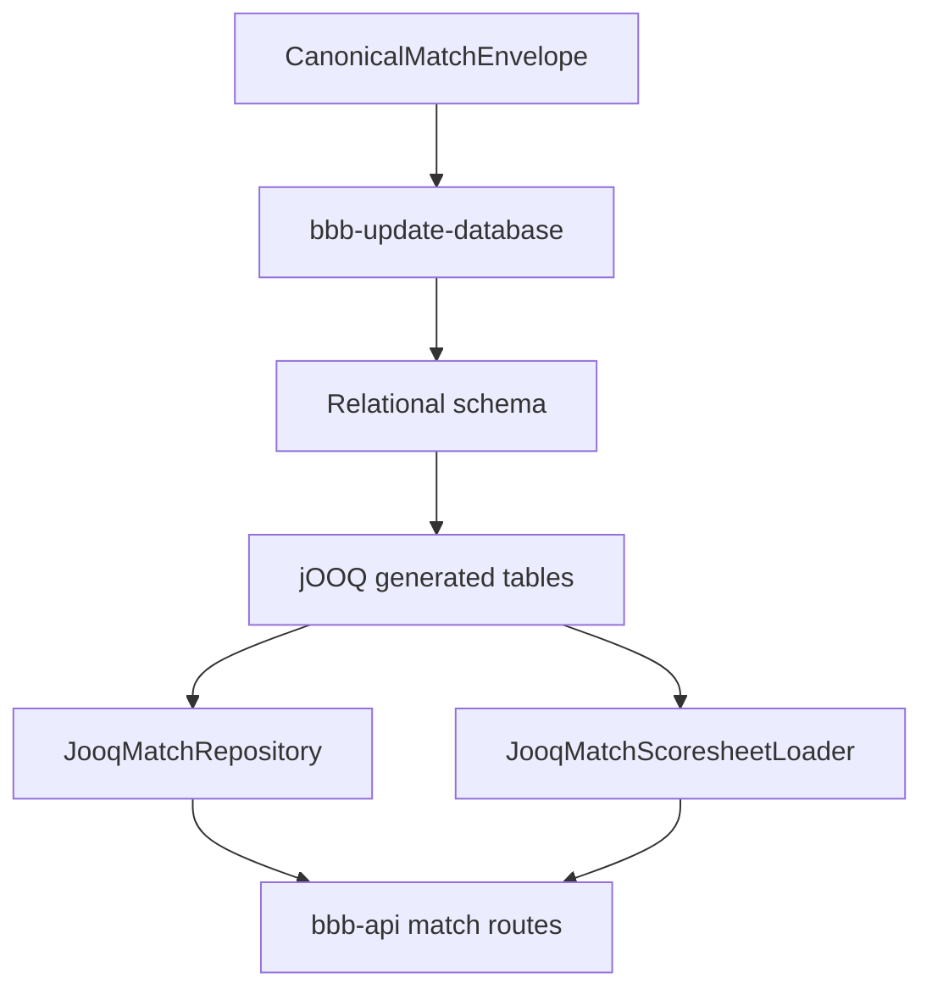

# Requirements

### Overview & Goals
Replace the dimensional warehouse model with a normalized relational match-data model without losing current ingestion, identity, provenance, scoresheet, search, and summary behavior. Use the original relational migration as a starting point, but reconcile it with every later addition in migrations `3__deterministic_match_identity.sql`, `4__public_match_id.sql`, and `5__widen_public_match_id.sql`.

### Scope

#### In scope
- Replace all `dim_*` and `fact_*` tables in the authoritative schema for MariaDB, PostgreSQL, and SQLite.
- Preserve a generated numeric primary key on `matches`, plus distinct `canonical_match_id` and nullable unique `public_match_id` values.
- Preserve `match_source_reference` provenance, including provider, provider record key, source record ID, and raw-content digest.
- Preserve teams, people, grounds, date metadata, matches, innings, deliveries, wickets, match roles, wicket associations, and fielder associations.
- Update `bbb-update-database` direct JDBC, SQL-script, and CSV output paths to write the relational model.
- Update `bbb-api` jOOQ generation and the matches repository/readers for recent matches, historical search, and scoresheets.
- Keep existing `bbb-shared` HTTP response contracts and public API behavior stable.
- Use a rebuild-and-replay cutover: back up the warehouse, create the new schema, then replay canonical envelopes rather than translating warehouse rows in place.
- Keep one authoritative `1__initial_tables.sql` migration per supported dialect by consolidating the complete relational cutover schema into it.

#### Out of scope
- Changing the canonical envelope format or Cricsheet parsing semantics.
- Adding new API endpoints or changing authentication, BFF, or web behavior.
- Maintaining dual writes or compatibility views with warehouse names after cutover.

### Functional Requirements
- No production table created by the new schema may use a `dim_` or `fact_` name.
- `matches.id` is the internal primary key and all dependent rows reference it; `canonical_match_id` remains the stable ingestion identity and `public_match_id` remains the URL/API identity.
- Replaying the same canonical envelope remains idempotent; a changed source digest is rejected using the existing provenance rule.
- All match officials and players remain representable through role assignments, including `PLAYER`, `UMPIRE`, `TV_UMPIRE`, `RESERVE_UMPIRE`, and `MATCH_REFEREE`.
- Recent match summaries, filtered/paginated historical search, and scoresheets retain their current response shapes and values.
- Scoresheets retain innings ordering, delivery ordering, run/extra fields, powerplay, non-boundary, wicket counts, wicket kinds, and wicket-specific fielders.
- SQL output remains executable for all supported dialects and CSV output remains loadable in parent-before-child order.
- Existing databases are treated as rebuild targets: the cutover procedure explicitly backs up the warehouse and replays all canonical envelopes after the relational schema is created.

### Acceptance Criteria
- A clean relational database can be created and populated from canonical envelopes with no references to `dim_*` or `fact_*` tables.
- A replayed dataset produces the same public match IDs, match summaries, search results, and scoresheet content as before the refactor.
- A source correction is detected from `match_source_reference` and does not silently leave stale relational rows.
- MariaDB, PostgreSQL, and SQLite schema/script paths pass their automated validation, and the full Gradle `check` task passes.

# Technical Design

### Current Implementation
- `bbb-update-database/src/main/kotlin/com/knowledgespike/ballbyball/parse/database/Database.kt` writes the complete envelope in parent-before-child order, but its domain names and calls (`WarehouseMatch`, `WarehouseInnings`, `insertMatchFact`) describe the current warehouse.
- `OutputAdapter`, `WarehouseWriteSupport`, `JdbcOutputAdapter`, `SqlScriptOutputAdapter`, `CsvOutputAdapter`, and the dialect-specific adapters encode warehouse table names, column lists, identity allocation, duplicate-safe inserts, and SQL literals.
- `DialectWarehouseSchemaSql` is the destructive schema source for generated SQL files; versioned migrations exist under `bbb-update-database/migrations/mysql`, `postgres`, and `sqlite`.
- `bbb-api` feature slice data access is concentrated in `JooqMatchRepository.kt` and `JooqMatchScoresheetLoader.kt`. The former joins `dim_match`, `dim_date`, `dim_team`, `dim_ground`, `fact_match`, `dim_innings`, and `fact_delivery`; the latter additionally reads `dim_person`, `dim_wicket`, `bridge_delivery_wicket`, and `bridge_delivery_fielder`.
- `bbb-api/build.gradle.kts` generates checked-in Kotlin jOOQ sources under `bbb-api/src/generated/jooq/kotlin`; the current generated tables are warehouse-named.

### Key Decisions
- **Canonical normalized tables:** use `dates`, `teams`, `people`, `grounds`, `matches`, `innings`, `deliveries`, and `wickets` as entity/data tables; use `match_people`, `delivery_wickets`, `delivery_fielders`, and `match_source_reference` as explicit association/provenance tables. This removes warehouse vocabulary while preserving all current relationships.
- **Merge match facts:** move `duration_days`, `margin`, and `match_count` into `matches`; there is no replacement for `fact_match`.
- **Direct delivery grain:** move all `fact_delivery` columns into `deliveries`, with `delivery.id` as the internal primary key and a unique source-ball identifier for ingestion deduplication.
- **Identity separation:** keep `matches.id`, `canonical_match_id`, and `public_match_id` distinct; do not derive canonical identity from filenames. Numeric IDs are internal relational keys, while public IDs remain the API-facing lookup.
- **Rebuild and replay:** add a versioned cutover schema rather than attempting fragile warehouse-key translation. Existing data is preserved operationally by backup and canonical-envelope replay, not by retaining compatibility tables.
- **One schema source per concern:** keep migration DDL authoritative for deployed databases and rename/rework `DialectWarehouseSchemaSql` into the relational schema generator so destructive SQL output and migrations stay equivalent. Record the decision in a new ADR under `docs/adr/`.

### Proposed Changes
1. Add the next versioned relational cutover migration for each supported dialect. It should drop dependent warehouse tables in reverse dependency order, create the normalized schema, define foreign keys/uniques/indexes, and avoid data-copy logic because the selected cutover is replay-based.
2. Carry forward the complete current contract when designing columns: match canonical/public identities, source provenance, date attributes, match measures, team/person/ground source identifiers, innings team roles, delivery ordering and run fields, wicket source/kind fields, role assignments, and fielder links.
3. Refactor updater records and write support away from warehouse terminology. Put match duration/margin in `MatchRecord`, remove the separate `insertMatchFact` contract, use relational table/column constants, and retain dialect-specific conflict behavior and transaction boundaries.
4. Update all updater outputs: direct JDBC SQL, generated SQL scripts, and CSV files must use the same relational columns and dependency order. Keep stable in-script key maps and duplicate suppression for match-person and delivery-fielder associations.
5. Regenerate jOOQ from the relational schema and update the matches data slice. Rewrite joins and field aliases in `JooqMatchRepository` and `JooqMatchScoresheetLoader` without changing `MatchRepository`, domain response models, route validation, or `bbb-shared` JSON contracts.
6. Update architecture documents and the ADR so contributor guidance describes relational tables, replay cutover, the new loading order, identity semantics, and API query paths instead of warehouse terminology.

### Data Models / Contracts
Target relational mapping:

| Relational table | Key data and preserved behavior |
| --- | --- |
| `dates` | `date_id`/calendar date plus current calendar-derived fields and uniqueness on the natural date. |
| `teams` | `id`, unique source team identifier, team name; referenced by match and innings roles. |
| `people` | `id`, source person ID, full/sort/other names, `ca_id`; shared by players and officials. |
| `grounds` | `id`, source ground identifier, ground name. |
| `matches` | `id` primary key, canonical/public IDs, source/file metadata, teams/ground/toss/result fields, date reference, duration, margin, and match count. |
| `match_source_reference` | Composite match/provider/source identity, provider record key, source record ID, and raw digest with current uniqueness rules. |
| `innings` | `id`, `match_id`, innings number, batting team ID, bowling team ID, unique per match/number. |
| `deliveries` | `id`, unique source-ball ID, match/innings/team/person references, sequence/order, runs/extras, non-boundary, powerplay, and wicket count. |
| `wickets` | `id`, source wicket ID, wicket kind. |
| `match_people` | Composite uniqueness for `match_id`, `person_id`, and role code. |
| `delivery_wickets` | Composite delivery/wicket association. |
| `delivery_fielders` | Composite delivery/wicket/person association. |

The API continues to expose `MatchSummary`, `MatchSearchResponse`, `MatchScoresheetPage`, and their existing envelope/error contracts. Only the internal jOOQ table bindings and SQL joins change.

### Architecture Diagram

### Risks
- Replaying into auto-generated numeric IDs can change internal IDs; API and ingestion logic must rely on canonical/public identities rather than assuming old warehouse keys are externally stable.
- The original relational migration omits later identity/provenance and warehouse-derived fields; the new schema must be reviewed against every migration and updater column constant before implementation.
- MariaDB, PostgreSQL, and SQLite differ in identity syntax, unsigned types, conflict clauses, schema selection, and generated-key behavior; keep dialect-specific DDL and adapter clauses explicit.
- Removing warehouse tables is destructive; the cutover runbook must require a backup and a complete canonical-envelope replay before the API is pointed at the new database.
- jOOQ generated sources must be regenerated from a representative relational database before API compilation; they should not be hand-edited.

# Testing

### Validation Approach
Use the existing JUnit 5 and Strikt seams, with database tests at the adapter/schema boundary and API integration tests against the relational schema. Validate behavior outside-in: create/populate the new schema, exercise updater writes, then exercise API reads and compare the public results with the current behavior.

### Key Scenarios
- Apply each relational migration to SQLite and verify table creation, foreign keys, unique identities, parent-before-child loading, and the absence of `dim_*`/`fact_*` tables.
- Generate MariaDB, PostgreSQL, and SQLite SQL scripts and verify their DDL, reset order, conflict clauses, and executable inserts.
- Load a canonical envelope containing all official roles, multiple innings, deliveries, multiple wickets, duplicate fielders, and source references; verify every relationship and duplicate-suppression rule.
- Replay the same envelope and verify no duplicate match, source reference, innings, delivery, role, wicket, or fielder rows are created.
- Load a second envelope with the same canonical identity and changed digest; verify correction detection rejects it.
- Verify `JooqMatchRepository` returns unchanged recent summaries, scores, search filters, pagination, ordering, and result formatting.
- Verify `JooqMatchScoresheetLoader` returns ordered innings/deliveries and wicket-specific fielders with the same completeness behavior.
- Verify the API integration path resolves a match by `public_match_id` and never depends on the internal `matches.id` value being the old warehouse key.

### Test Changes
- Update `WarehouseWriteSupportTest`, `SqlScriptOutputAdapterTest`, `CsvOutputAdapterTest`, `SqliteOutputAdapterTest`, and `DatabaseTest` to the relational write-support names, columns, tables, and merged match measures; add coverage for all preserved identity/provenance fields.
- Replace `SqliteMatchIdentityMigrationTest` with relational cutover/replay coverage, including canonical/public identity uniqueness and `match_source_reference` behavior.
- Update `JooqMatchRepositoryIntegrationTest` to provision/query the relational schema and retain the recent-match and full-scoresheet assertions.
- Add API integration fixtures that cover search joins and a scoresheet containing wickets and fielders, not just empty or partial delivery sets.
- Run `./gradlew clean check --no-daemon` across all modules and inspect coverage/static-analysis results; do not suppress failures.

# Delivery Steps

### ✓ Step 1: Define and migrate the normalized relational schema
A versioned relational schema exists for MariaDB, PostgreSQL, and SQLite with all warehouse tables replaced and current identities/features represented.

- Add the next dialect-specific migration under `bbb-update-database/migrations/{mysql,postgres,sqlite}`.
- Define `dates`, `teams`, `people`, `grounds`, `matches`, `innings`, `deliveries`, `wickets`, `match_people`, `delivery_wickets`, `delivery_fielders`, and `match_source_reference` with explicit keys, foreign keys, unique constraints, and query indexes.
- Merge match measures into `matches` and delivery measures into `deliveries`.
- Preserve `matches.id`, canonical/public match identity, source provenance, source IDs, role codes, wicket/fielder relationships, and date metadata.
- Add `docs/adr/0005-relational-database-schema.md` documenting the normalized schema and rebuild-and-replay decision.

### ✓ Step 2: Refactor bbb-update-database writers to the relational contract
`bbb-update-database` writes canonical envelopes to the new relational tables through JDBC, SQL scripts, and CSV output.

- Replace warehouse-specific entities and contracts in `Database.kt`, `Entities.kt`, `OutputAdapter`, and `WarehouseWriteSupport` with relational terminology and merged match records.
- Update `JdbcOutputAdapter` and every MariaDB/PostgreSQL/SQLite adapter for relational table names, generated keys, upserts, conflict clauses, and source/reference checks.
- Update `SqlScriptOutputAdapter` and `DialectWarehouseSchemaSql` so generated scripts reset and create the relational schema in dependency order.
- Update `CsvOutputAdapter` headers, column order, and load ordering to match the relational schema.
- Keep transactions, idempotency, changed-source rejection, duplicate match-person handling, and duplicate fielder suppression intact.

### ✓ Step 3: Regenerate jOOQ and update API match reads
The `bbb-api` matches feature reads the relational schema while preserving all current REST response behavior.

- Generate replacement jOOQ sources under `bbb-api/src/generated/jooq/kotlin` from the relational schema and update the generation configuration in `bbb-api/build.gradle.kts`.
- Rewrite `JooqMatchRepository.kt` and `MatchSearchConditionBuilder.kt` to join `matches`, `dates`, `teams`, `grounds`, `innings`, and `deliveries`, with match measures read directly from `matches`.
- Rewrite `JooqMatchScoresheetLoader.kt` to use `innings`, `deliveries`, `people`, `wickets`, `delivery_wickets`, and `delivery_fielders` while retaining ordering and completeness calculations.
- Keep `MatchRepository`, domain models, `MatchesRoute`, tiny-type validation, and `bbb-shared` JSON contracts stable unless compilation identifies a necessary internal field rename.
- Update database setup/configuration references that describe the old warehouse table set.

### ✓ Step 4: Replay data, verify behavior, and update architecture documentation
A rebuilt relational database is populated from canonical envelopes and passes updater/API regression validation with current documentation aligned.

- Update updater, migration, and API tests for the relational schema, identity/provenance rules, role assignments, wickets, fielders, recent summaries, search, and scoresheets.
- Validate a backup-first rebuild and full canonical-envelope replay path rather than attempting warehouse-row translation.
- Run `./gradlew clean check --no-daemon` and resolve all failures without suppressions.
- Update `docs/architecture/database.md`, `docs/architecture/applications.md`, relevant setup/README references, and `docs/project_memory.md` to remove stale warehouse assumptions and record shipped behavior, decisions, gotchas, and coverage.

### ✓ Step 5: Consolidate dialect migrations
Each supported dialect has one authoritative `1__initial_tables.sql` containing the complete relational schema, with obsolete versioned migrations removed and references updated.

- Replace each dialect's initial migration with its existing relational cutover schema.
- Remove the obsolete `2__` through `6__` migration files for MySQL, PostgreSQL, and SQLite.
- Update migration tests and setup documentation to use the single initial migration.
- Run migration-focused tests and the full Gradle check.