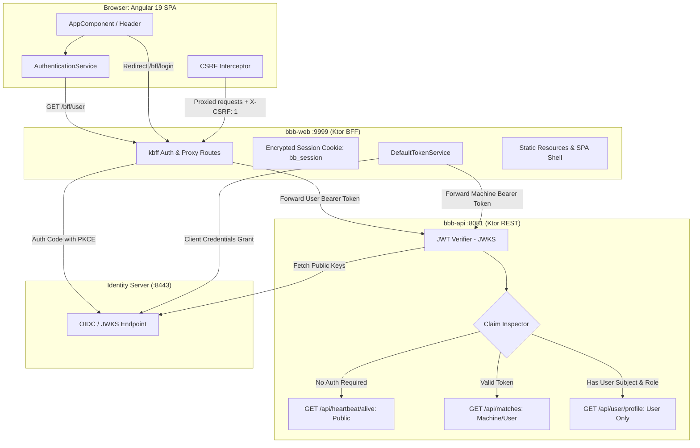
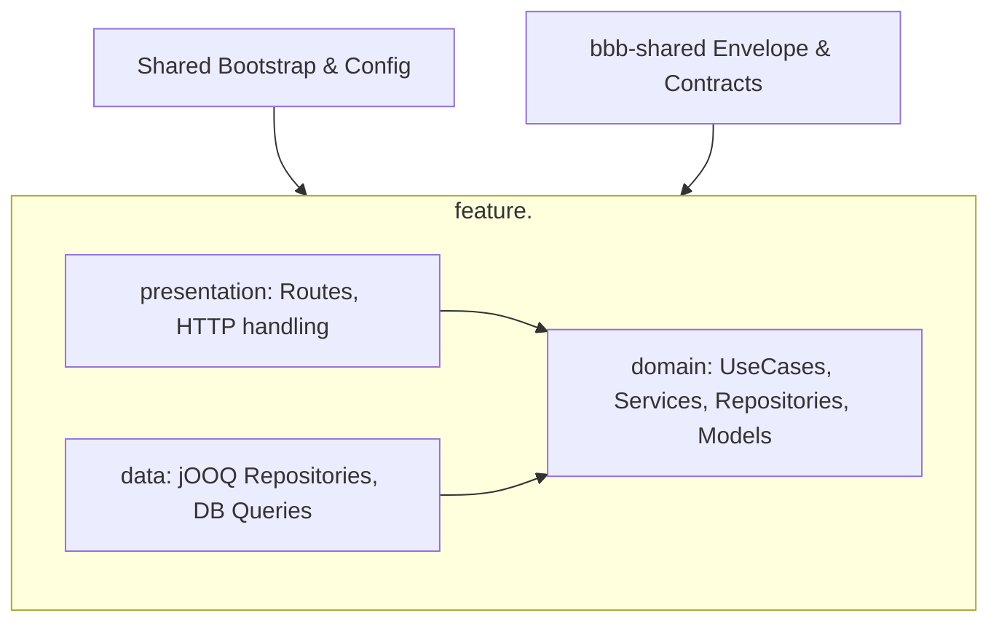
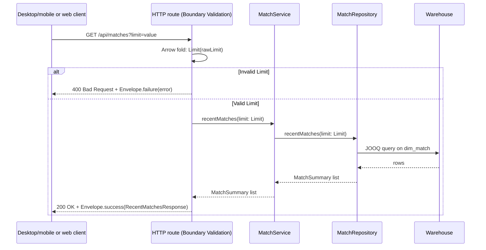

# Ball by Ball applications

## Scope

The repository contains two Ktor applications alongside the existing data
loader:

| Module    | Responsibility                                                                | Default port |
|-----------|-------------------------------------------------------------------------------|--------------|
| `bbb-api` | Read warehouse data through JOOQ, verify JWT bearer tokens, expose REST API   | `8081`       |
| `bbb-web` | Host Angular SPA, handle OIDC BFF login/logout sessions, proxy secure requests| `9999`       |

Both applications use the shared `bbb-shared` module for serialized HTTP
contracts. Gradle module registration is kept in `settings.gradle.kts`, and all
versions are declared in `gradle/libs.versions.toml`.

## Runtime flow & Authentication Architecture



### Three-Tier API Access Model
1. **Tier 1 (Unauthenticated / Public)**:
   - `/health`: Database liveness check.
   - `/api/heartbeat/alive`: Unauthenticated heartbeat returning `{ "message": "Heartbeat: Alive" }`.
2. **Tier 2 (Machine / BFF Authenticated)**:
   - `/api/matches`: Protected with `auth-jwt`. Accessible with a valid client-credentials machine token (used by `bbb-web` via `DefaultTokenService` when an anonymous visitor browses recent matches) or a logged-in user token.
3. **Tier 3 (Human User Authenticated)**:
   - `/api/user/profile`: Protected with `auth-jwt`. Requires verified human user subject claim and assigned user roles. Rejects machine-only tokens with `403 Forbidden` and unauthenticated calls with `401 Unauthorized`.

### Backend-For-Frontend (BFF) Pattern with `kbff`
`bbb-web` implements the Backend-For-Frontend security pattern using `com.knowledgespike:kbff`:
- **No tokens in browser storage**: Access and refresh tokens are kept server-side in encrypted `bb_session` cookies with `HttpOnly`, `SameSite=Lax`, and `Secure` attributes.
- **Login (`/bff/login`)**: Generates PKCE code verifier and challenge, redirecting the browser to the Identity Server authorization endpoint.
- **Callback (`/signin-oidc`)**: Validates the authorization code, exchanges it for access/refresh tokens, and establishes the encrypted session cookie.
- **Session Info (`/bff/user`)**: Exposes current user claims (`name`, `email`, `sub`), anti-CSRF token, and `bff:logout_url`. Returns `401 Unauthorized` for anonymous visitors.
- **Logout (`/bff/logout`)**: Clears the session cookie and redirects to the Identity Server end-session endpoint.
- **Anti-CSRF Protection**: All proxied mutating requests and user endpoints require `X-CSRF: 1` header verification.
- **Machine Token Service (`DefaultTokenService`)**: Automatically obtains and caches OAuth2 client-credentials tokens from the Identity Server for background and anonymous API requests.

## Architecture: Feature Slices

`bbb-api` is structured using **Feature Slices** (following the pattern established in `acs-api`). Instead of organizing code by global horizontal technical layers, each distinct feature has its own self-contained directory containing everything related to that feature that is not shared across features:



Each feature slice contains:
- `presentation`: Ktor route definitions, parameter parsing and validation, HTTP response mapping.
- `domain`: Feature services/use cases, domain models, and repository interfaces.
- `data`: jOOQ repository implementations and database queries.

### Feature Layout (`bbb-api`)

| Feature | Package | Presentation | Domain | Data |
|---|---|---|---|---|
| **Heartbeat** | `feature.heartbeat` | `HeartbeatRoute.kt` (`GET /api/heartbeat/alive`) | — | — |
| **Health** | `feature.health` | `HealthRoute.kt` (`GET /health`) | `DatabaseHealth.kt` | `JooqDatabaseHealth.kt` |
| **Matches** | `feature.matches` | `MatchesRoute.kt` (`GET /api/matches`) | `MatchRepository.kt`, `MatchService.kt` | `JooqMatchRepository.kt` |
| **User** | `feature.user` | `UserRoute.kt` (`GET /api/user/profile`) | — | — |

Shared infrastructure and cross-cutting concerns (bootstrap, database connection pool, JWT authentication and verifiers) reside in top-level packages:
- `bootstrap`: `ApiModule.kt` (Ktor application configuration, route registration), `Security.kt` (JWT authentication, claim validation, userProtected route plugin).
- `config`: `DatabaseResources.kt`, `DatabaseSettings.kt`, `JwtSettings.kt`.

### API request flow



`Limit` is a validated inline value type (`@JvmInline value class`). Boundary validation
is performed directly in the presentation route layer using Arrow (`fold` / `Raise`).
Invalid client parameters immediately return `400 Bad Request` with `Envelope.failure(...)`;
unexpected adapter failures are logged by `StatusPages` and returned as a generic
`Envelope.failure(...)` with `500 Internal Server Error`. Cancellation is never converted to
an error response.

### Tiny Types and Domain Boundaries

The application enforces strong typing at compile-time with zero runtime overhead using Kotlin value classes (`@JvmInline value class`):
- `Limit`: Encapsulates query limit bounds (`1..100`, default `10`).
- `MatchKey`: Encapsulates unique match surrogate keys (`> 0`).
- `SourceMatchId`: Encapsulates external match identifiers (`>= 0`).
- `MatchType`: Encapsulates non-blank cricket match types (e.g. `Test`, `ODI`, `T20`).
- `Season`: Encapsulates non-blank cricket seasons (e.g. `2023/24`, `1992`).
- `UserId`: Encapsulates non-blank user subject identifiers.

Boundary validation uses Arrow's `Raise` and `Either` DSL. All value classes declare private constructors and companion factory methods (`invoke` with `Raise`, `of` returning `Either`, and `from` for validated internal mapping). In multi-parameter endpoints, `zipOrAccumulate` accumulates all parameter validation failures into a `NonEmptyList<Error>`. Domain services and repositories only accept validated tiny types, making illegal arguments unrepresentable in the domain layer.

### Web request flow

`web.adapter.in.http.WebRoutes` depends on `MatchApiClient`, not on Ktor's
`HttpClient`. `KtorMatchApiClient` is the production adapter and maps non-2xx,
connection, timeout, and malformed JSON failures to `MatchApiResult.Unavailable`.
API responses are returned as typed JSON (`RecentMatchesResponse` or `ApiError`)
with appropriate HTTP status codes (e.g. `502 Bad Gateway` on failure).
The public `GET /api/metadata` route combines the API envelope timestamp with
the build-generated `version.properties` resource, allowing the Angular footer
to show the latest data-response time, application version, and build date.
Static single page application assets and index fallbacks are handled via
Ktor's `singlePageApplication` configurator.

### Shared JSON contracts

`bbb-shared/src/main/kotlin/com/knowledgespike/ballbyball/contracts/ApiContracts.kt`
and `Envelope.kt` define the JSON classes exchanged between services and clients.
All API responses are wrapped in a generic `Envelope<T>` contract, which provides:
- `result: T`: The payload on successful operations (or empty/default on failures).
- `errorMessage: String`: Error details or validation failure message (empty on success).
- `timeGenerated: Instant`: The server timestamp when the response was constructed.

The module uses `kotlinx.serialization` and currently defines `Envelope`, `ApiHealth`, `ApiError`,
`MatchSummary`, `RecentMatchesResponse`, `ApplicationMetadata`, and `UserProfileResponse`. Desktop/mobile clients and the web
adapter consume these same classes; database rows and HTML remain application-specific representations.

When a new endpoint is added, define its request and response/error contracts in
`bbb-shared` first, validate the request in the API application layer, and keep
the route limited to transport translation.

## `bbb-api`

`bbb-api` is composed of four self-contained feature slices (`heartbeat`, `health`, `matches`, and `user`), backed by shared bootstrap and configuration:
- `feature.heartbeat`: Exposes public liveness heartbeat (`GET /api/heartbeat/alive`).
- `feature.health`: Contains `DatabaseHealth` domain interface, `JooqDatabaseHealth` repository, and `HealthRoute` (`GET /health`).
- `feature.matches`: Contains `MatchRepository` domain interface, `MatchService` use-case handler, `JooqMatchRepository` data adapter, and `MatchesRoute` (`GET /api/matches`).
- `feature.user`: Exposes user-protected profile details (`GET /api/user/profile`).

Blocking JOOQ/JDBC queries in repositories run on `Dispatchers.IO` rather than on Ktor request threads. The repositories select the JOOQ dialect from the configured JDBC URL, use the warehouse `dim_match` table and a Hikari connection pool, and keep queries focused and lightweight.

Hikari is configured not to fail application startup when the database is unavailable. `/health` then reports the connection state as `200` or `503`, while match-query failures are logged and returned as server errors.

Endpoints:

- `GET /health` checks that the configured database connection can execute a
  query. It returns `200` when healthy and `503` otherwise.
- `GET /api/matches?limit=25` returns recent matches ordered by match start date (with the warehouse key as a
  deterministic tie-breaker). The limit must be
  numeric and between `1` and `100`.

Database configuration is supplied through environment variables. The defaults
target the local MariaDB database used by the setup guide:

| Variable           | Default                                          | Purpose            |
|--------------------|--------------------------------------------------|--------------------|
| `API_PORT`         | `8081`                                           | API listening port |
| `DB_JDBC_URL`      | `jdbc:mariadb://localhost:3306/acs_ball_by_ball` | JDBC URL           |
| `DB_USER`          | `acs_ball_by_ball`                               | Database user      |
| `DB_PASSWORD`      | empty                                            | Database password  |
| `DB_MAX_POOL_SIZE` | `10`                                             | Hikari pool size   |

For the PostgreSQL test container, use a URL with the warehouse schema in the
connection properties:

```bash
export DB_JDBC_URL='jdbc:postgresql://localhost:5433/acs_ball_by_ball?currentSchema=acs_ball_by_ball'
export DB_USER=acs_ball_by_ball
export DB_PASSWORD='acs_ball_by_ball-local-password'
```

## `bbb-web`

`bbb-web` owns the static browser entry point and an application `MatchApiClient`
port. Its inbound `/matches` route asks the port for shared `MatchSummary`
values, passes them to the pure HTML renderer, and returns `text/html` for HTMX.
The production `KtorMatchApiClient` has bounded request, connection, and socket
timeouts. API status failures, connection failures, timeouts, and malformed JSON
are mapped to `502 Bad Gateway`; cancellation is preserved. The client is
closed with the application lifecycle in the bootstrap module and can be
replaced in tests without starting `bbb-api`.

| Variable       | Default                 | Purpose                     |
|----------------|-------------------------|-----------------------------|
| `WEB_PORT`     | `9999`                  | Web listening port          |
| `API_BASE_URL` | `http://localhost:8081` | Base URL used for API calls |

Both applications use `application.yaml` and Ktor's YAML configuration module.
Environment substitutions use the `${ENV:default}` form. The files are
`bbb-api/src/main/resources/application.yaml` and
`bbb-web/src/main/resources/application.yaml`.

## Running locally

Start the API with a migrated database available:

```bash
DB_JDBC_URL='jdbc:mariadb://localhost:3307/acs_ball_by_ball' \
DB_USER=acs_ball_by_ball \
DB_PASSWORD='acs_ball_by_ball-local-password' \
./gradlew :bbb-api:run --no-daemon
```

In another shell, start the web application:

```bash
API_BASE_URL=http://localhost:8081 \
./gradlew :bbb-web:run --no-daemon
```

Open `http://localhost:9999`, select **Load recent matches**, and verify that
the returned list came through the API. The Docker database preparation steps
are documented in `docs/setup/SETUP-DB.md`.

## Testing

The API tests inject the repository and health ports and cover healthy/unhealthy
health responses, valid result serialization, numeric limit validation, and the
unavailable-database startup path. The web tests inject a Ktor `MockEngine`
through the outbound HTTP adapter and cover successful shared-contract decoding,
HTML rendering, API status, connection, and malformed JSON failures. Pure
application validation and HTML rendering can be tested without Ktor. Run both
suites with:

```bash
./gradlew :bbb-api:test :bbb-web:test --no-daemon
```