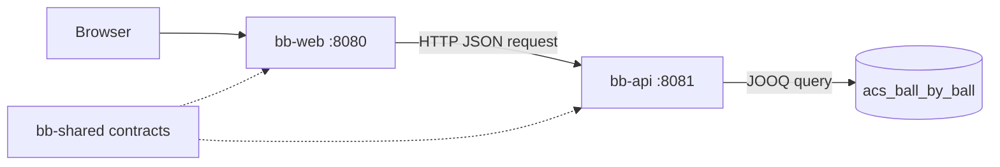
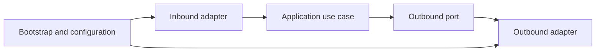
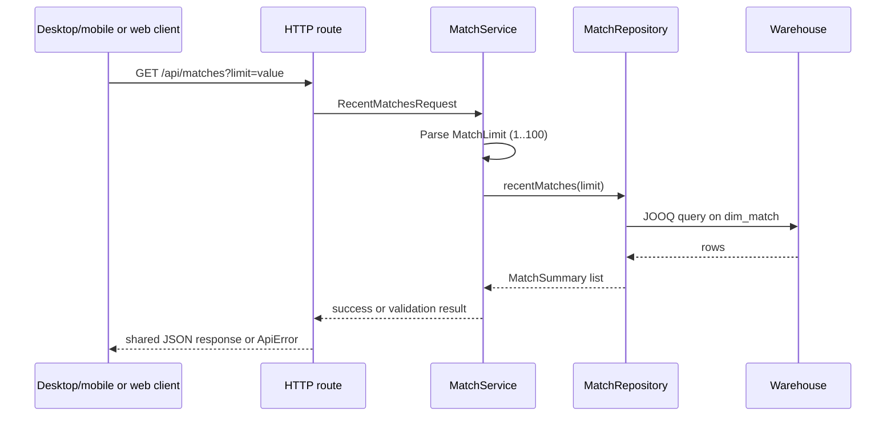

# Ball by Ball applications

## Scope

The repository contains two Ktor applications alongside the existing data
loader:

| Module   | Responsibility                                                                | Default port |
|----------|-------------------------------------------------------------------------------|--------------|
| `bb-api` | Read warehouse data through JOOQ and expose JSON HTTP endpoints               | `8081`       |
| `bb-web` | Serve the static HTMX front end and translate browser requests into API calls | `8080`       |

Both applications use the shared `bb-shared` module for serialized HTTP
contracts. Gradle module registration is kept in `settings.gradle.kts`, and all
versions are declared in `gradle/libs.versions.toml`.

## Runtime flow



The web application serves `bb-web/src/main/resources/static/index.html`.
The page uses HTMX to request `/matches`; `bb-web` calls `/api/matches` on
`bb-api`, converts the JSON response into an HTML fragment, and returns that
fragment to the browser. This keeps browser-facing rendering separate from the
warehouse query implementation.

## Layered structure

The applications use a small ports-and-adapters arrangement. It is deliberately
package-based rather than split into Gradle subprojects: the applications are
small, but the seams are explicit and can be tested without starting a server or
database.



The dependency direction is inward:

| Layer                   | `bb-api`                      | `bb-web`                         | Rule                                                                            |
|-------------------------|-------------------------------|----------------------------------|---------------------------------------------------------------------------------|
| Bootstrap/configuration | `api.bootstrap`, `api.config` | `web.bootstrap`                  | Creates concrete adapters and installs Ktor plugins.                            |
| Inbound adapter         | `api.adapter.in.http`         | `web.adapter.in.http`            | Translates HTTP requests/responses; contains no JOOQ or raw `HttpClient` calls. |
| Application             | `api.application.service`     | `web.application`                | Validates input and coordinates use cases through interfaces.                   |
| Outbound port           | `api.application.port.out`    | `web.application.MatchApiClient` | Small interfaces owned by the application that needs them.                      |
| Outbound adapter        | `api.adapter.out.jooq`        | `web.adapter.out.api`            | Implements a port using JOOQ/JDBC or Ktor HTTP.                                 |

The `in` package is escaped in Kotlin imports as ``adapter.`in`.http`` because
`in` is a Kotlin keyword.

### API request flow



`MatchLimit` is a validated inline value type. Expected client errors are
returned as the shared `ApiError` contract with `400 Bad Request`; unexpected
adapter failures are logged by `StatusPages` and returned as a generic shared
`ApiError` with `500 Internal Server Error`. Cancellation is never converted to
an error response.

### Web request flow

`web.adapter.in.http.WebRoutes` depends on `MatchApiClient`, not on Ktor's
`HttpClient`. `KtorMatchApiClient` is the production adapter and maps non-2xx,
connection, timeout, and malformed JSON failures to `MatchApiResult.Unavailable`.
`MatchHtmlRenderer` is a pure presenter that escapes all values before placing
them into HTML. A browser-facing failure is consequently rendered as
`502 Bad Gateway` without leaking transport or exception details.

### Shared JSON contracts

`bb-shared/src/main/kotlin/com/knowledgespike/ballbyball/contracts/ApiContracts.kt`
is the only home for JSON classes exchanged with clients. It uses
`kotlinx.serialization` and currently defines `ApiHealth`, `ApiError`,
`MatchSummary`, and `RecentMatchesResponse`. Desktop/mobile clients and the web
adapter consume these same classes; database rows and HTML remain application-
specific representations.

When a new endpoint is added, define its request and response/error contracts in
`bb-shared` first, validate the request in the API application layer, and keep
the route limited to transport translation.

## `bb-api`

`bb-api` has an inbound HTTP adapter, an application `MatchService`, outbound
`MatchRepository` and `DatabaseHealth` ports, and a JOOQ adapter. The ports are
small and suspendable; `JooqMatchRepository` runs blocking JOOQ/JDBC work on
`Dispatchers.IO` rather than on Ktor request threads. The repository selects the
JOOQ dialect from the configured JDBC URL, uses the warehouse `dim_match` table
and a Hikari connection pool, and keeps the first query deliberately small;
generated JOOQ sources can be introduced when the schema and query surface have
stabilised.

Hikari is configured not to fail application startup when the database is
unavailable. `/health` then reports the connection state as `200` or `503`,
while match-query failures are logged and returned as server errors.

Endpoints:

- `GET /health` checks that the configured database connection can execute a
  query. It returns `200` when healthy and `503` otherwise.
- `GET /api/matches?limit=25` returns recent matches ordered by match start date (with the warehouse key as a
  deterministic tie-breaker). The limit must be
  numeric and between `1` and `100`.

Database configuration is supplied through environment variables. The defaults
target the local MariaDB database used by the setup guide:

| Variable           | Default                                          | Purpose            |
|--------------------|--------------------------------------------------|--------------------|
| `API_PORT`         | `8081`                                           | API listening port |
| `DB_JDBC_URL`      | `jdbc:mariadb://localhost:3306/acs_ball_by_ball` | JDBC URL           |
| `DB_USER`          | `acs_ball_by_ball`                               | Database user      |
| `DB_PASSWORD`      | empty                                            | Database password  |
| `DB_MAX_POOL_SIZE` | `10`                                             | Hikari pool size   |

For the PostgreSQL test container, use a URL with the warehouse schema in the
connection properties:

```bash
export DB_JDBC_URL='jdbc:postgresql://localhost:5433/acs_ball_by_ball?currentSchema=acs_ball_by_ball'
export DB_USER=acs_ball_by_ball
export DB_PASSWORD='acs_ball_by_ball-local-password'
```

## `bb-web`

`bb-web` owns the static browser entry point and an application `MatchApiClient`
port. Its inbound `/matches` route asks the port for shared `MatchSummary`
values, passes them to the pure HTML renderer, and returns `text/html` for HTMX.
The production `KtorMatchApiClient` has bounded request, connection, and socket
timeouts. API status failures, connection failures, timeouts, and malformed JSON
are mapped to `502 Bad Gateway`; cancellation is preserved. The client is
closed with the application lifecycle in the bootstrap module and can be
replaced in tests without starting `bb-api`.

| Variable       | Default                 | Purpose                     |
|----------------|-------------------------|-----------------------------|
| `WEB_PORT`     | `8080`                  | Web listening port          |
| `API_BASE_URL` | `http://localhost:8081` | Base URL used for API calls |

Both applications use `application.yaml` and Ktor's YAML configuration module.
Environment substitutions use the `${ENV:default}` form. The files are
`bb-api/src/main/resources/application.yaml` and
`bb-web/src/main/resources/application.yaml`.

## Running locally

Start the API with a migrated database available:

```bash
DB_JDBC_URL='jdbc:mariadb://localhost:3307/acs_ball_by_ball' \
DB_USER=acs_ball_by_ball \
DB_PASSWORD='acs_ball_by_ball-local-password' \
./gradlew :bb-api:run --no-daemon
```

In another shell, start the web application:

```bash
API_BASE_URL=http://localhost:8081 \
./gradlew :bb-web:run --no-daemon
```

Open `http://localhost:8080`, select **Load recent matches**, and verify that
the returned list came through the API. The Docker database preparation steps
are documented in `docs/setup/SETUP-DB.md`.

## Testing

The API tests inject the repository and health ports and cover healthy/unhealthy
health responses, valid result serialization, numeric limit validation, and the
unavailable-database startup path. The web tests inject a Ktor `MockEngine`
through the outbound HTTP adapter and cover successful shared-contract decoding,
HTML rendering, API status, connection, and malformed JSON failures. Pure
application validation and HTML rendering can be tested without Ktor. Run both
suites with:

```bash
./gradlew :bb-api:test :bb-web:test --no-daemon
```