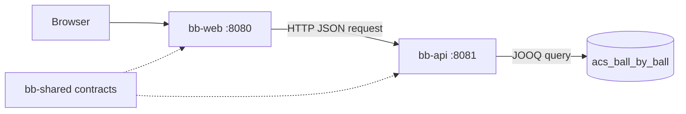

# Ball by Ball applications

## Scope

The repository contains two Ktor applications alongside the existing data
loader:

| Module | Responsibility | Default port |
| --- | --- | --- |
| `bb-api` | Read warehouse data through JOOQ and expose JSON HTTP endpoints | `8081` |
| `bb-web` | Serve the static HTMX front end and translate browser requests into API calls | `8080` |

Both applications use the shared `bb-shared` module for serialized HTTP
contracts. Gradle module registration is kept in `settings.gradle.kts`, and all
versions are declared in `gradle/libs.versions.toml`.

## Runtime flow



The web application serves `bb-web/src/main/resources/static/index.html`.
The page uses HTMX to request `/matches`; `bb-web` calls `/api/matches` on
`bb-api`, converts the JSON response into an HTML fragment, and returns that
fragment to the browser. This keeps browser-facing rendering separate from the
warehouse query implementation.

## `bb-api`

`bb-api` uses a small `MatchRepository` interface as the seam between HTTP
routing and persistence. `JooqMatchRepository` uses JOOQ's DSL with the
warehouse `dim_match` table and a Hikari connection pool. The first query is
deliberately small; generated JOOQ sources can be introduced when the schema
and query surface have stabilised.

Endpoints:

- `GET /health` checks that the configured database connection can execute a
  query. It returns `200` when healthy and `503` otherwise.
- `GET /api/matches?limit=25` returns recent matches ordered by warehouse key.
  The limit must be between `1` and `100`.

Database configuration is supplied through environment variables. The defaults
target the local MariaDB database used by the setup guide:

| Variable | Default | Purpose |
| --- | --- | --- |
| `API_PORT` | `8081` | API listening port |
| `DB_JDBC_URL` | `jdbc:mariadb://localhost:3306/acs_ball_by_ball` | JDBC URL |
| `DB_USER` | `acs_ball_by_ball` | Database user |
| `DB_PASSWORD` | empty | Database password |
| `DB_MAX_POOL_SIZE` | `10` | Hikari pool size |

For the PostgreSQL test container, use a URL with the warehouse schema in the
connection properties:

```bash
export DB_JDBC_URL='jdbc:postgresql://localhost:5433/acs_ball_by_ball?currentSchema=acs_ball_by_ball'
export DB_USER=acs_ball_by_ball
export DB_PASSWORD='acs_ball_by_ball-local-password'
```

## `bb-web`

`bb-web` owns the static browser entry point and an injected Ktor HTTP client.
Its `/matches` route calls the API, maps the shared `MatchSummary` contract to
an escaped HTML list, and returns `text/html` for HTMX. The client is closed
with the application lifecycle in the production module and can be replaced in
tests without starting `bb-api`.

| Variable | Default | Purpose |
| --- | --- | --- |
| `WEB_PORT` | `8080` | Web listening port |
| `API_BASE_URL` | `http://localhost:8081` | Base URL used for API calls |

## Running locally

Start the API with a migrated database available:

```bash
DB_JDBC_URL='jdbc:mariadb://localhost:3307/acs_ball_by_ball' \
DB_USER=acs_ball_by_ball \
DB_PASSWORD='acs_ball_by_ball-local-password' \
./gradlew :bb-api:run --no-daemon
```

In another shell, start the web application:

```bash
API_BASE_URL=http://localhost:8081 \
./gradlew :bb-web:run --no-daemon
```

Open `http://localhost:8080`, select **Load recent matches**, and verify that
the returned list came through the API. The Docker database preparation steps
are documented in `docs/setup/SETUP-DB.md`.

## Testing

The API tests inject a fake repository and cover the health response and limit
validation. The web test injects a Ktor `MockEngine` and verifies that JSON from
the API becomes an HTML fragment. Run both suites with:

```bash
./gradlew :bb-api:test :bb-web:test --no-daemon
```