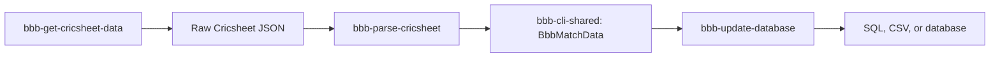
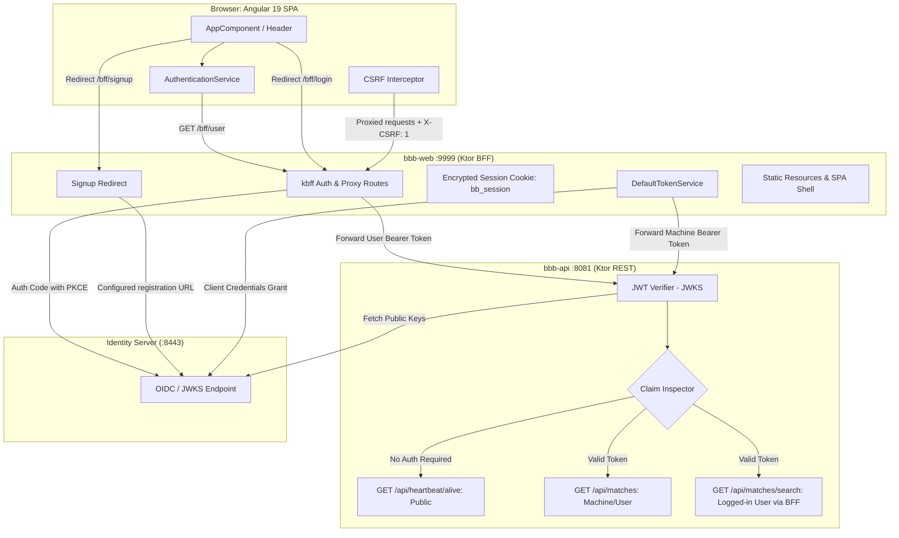
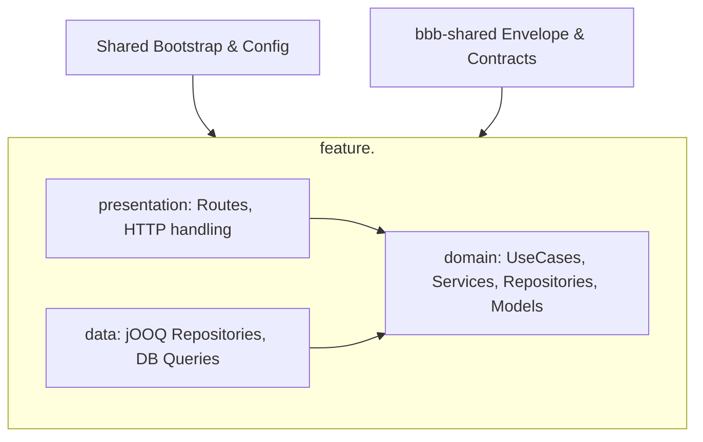
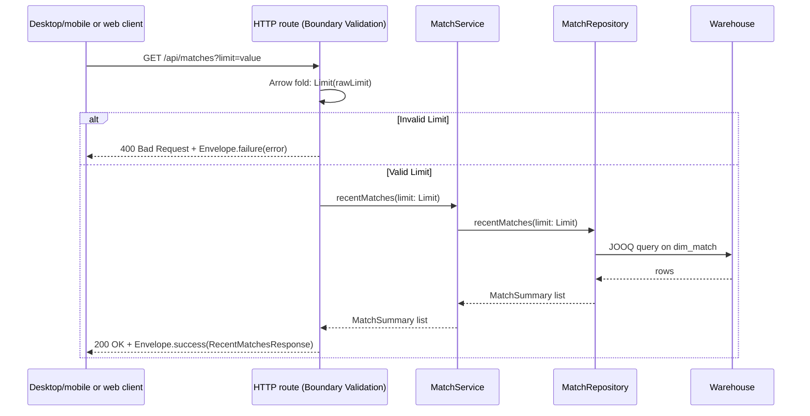

# Ball by Ball applications

## Scope

The repository contains two Ktor applications and four command-line/shared
modules alongside the shared contracts module:

| Module                  | Responsibility                                                                  | Default port |
|-------------------------|---------------------------------------------------------------------------------|--------------|
| `bbb-api`               | Read warehouse data through JOOQ, verify JWT bearer tokens, expose REST API     | `8081`       |
| `bbb-web`               | Host Angular SPA, handle OIDC BFF login/logout sessions, proxy secure requests | `9999`       |
| `bbb-update-database`   | Read normalized match data and write warehouse output                            | —            |
| `bbb-get-cricsheet-data`| Command-line entry point for retrieving raw Cricsheet data                       | —            |
| `bbb-cli-shared`        | Source-neutral `BbbMatchData` schema shared by CLI applications                 | —            |
| `bbb-parse-cricsheet`   | Convert raw Cricsheet JSON into shared-schema JSON                               | —            |

The API and web applications use `bbb-shared` for serialized HTTP contracts.
The CLI parser and updater use `bbb-cli-shared` for the source-neutral match
schema. Gradle module registration is kept in `settings.gradle.kts`, and all
versions are declared in `gradle/libs.versions.toml`.

### Normalized match-data workflow

The CLI data path is intentionally split into source retrieval, source
adaptation, and warehouse loading:


```mermaid
flowchart LR
    RETRIEVE[bbb-get-cricsheet-data] --> RAW[Raw Cricsheet JSON]
    RAW --> PARSE[bbb-parse-cricsheet]
    PARSE --> SHARED[bbb-cli-shared: BbbMatchData]
    SHARED --> UPDATE[bbb-update-database]
    UPDATE --> WAREHOUSE[SQL, CSV, or database]
```

`bbb-parse-cricsheet` owns the annotated Cricsheet input model and maps source
format/gender values to warehouse match types. `bbb-cli-shared` contains the
normalized document with Kotlin-compatible camelCase property names, exposes
match details under `match`, and omits Cricsheet-only `meta`; it has no
Cricsheet-specific `@SerialName` annotations. The updater consumes only this
normalized schema, so archive directory names and source-specific field names
are not part of its contract.

The parser requires an absolute `--base-directory` plus safe relative
`--input` and `--output` directories. It recursively mirrors JSON files,
atomically replaces managed outputs, preserves unrelated files, and continues
after individual failures before returning a non-zero result.

`bbb-get-cricsheet-data` is intentionally a standalone command-line application.
It supports a full retrieval mode that discovers JSON archive links from the
Cricsheet matches page and a nightly mode that downloads two fixed recent
archives. Both modes download and validate the register CSV files, validate
the downloaded artifacts, and extract match JSON into local directories. It
does not share the API or web runtime and uses the JDK HTTP client with an
injectable transport seam for deterministic tests.

### Cricsheet retrieval workflow

The application requires an absolute base directory and a relative data
directory, then creates missing directories and processes sources sequentially.
Register CSVs are always written directly under the base directory. Full mode
rejects an existing data directory unless `--force` is provided:

1. Fetch the matches page and select HTTPS Cricsheet links ending in
   `_json.zip`, excluding `all_json.zip`.
2. Download each archive to `data/zips` using retries and atomic replacement.
3. Validate and stage each ZIP before safely committing its extracted files to
   the data directory.
4. Download and validate `people.csv` and `names.csv` from the Cricsheet
   register into the base directory.

Nightly mode (`--nightly`/`-n`) bypasses page discovery and processes exactly
these sources in order:

1. `https://cricsheet.org/downloads/recently_added_7_json.zip`
2. `https://cricsheet.org/downloads/recently_added_2_json.zip`

The ZIPs are stored under `[base]/[data]/zips` and their validated contents are
staged and merged directly into `[base]/[data]`, without an implicit `nightly`
directory or archive-named child directories. The second archive overwrites
collisions from the first. Nightly mode reuses the data directory, replaces
managed ZIP, extracted, and CSV files, preserves stale or unrelated files, and
rejects regular-file destination conflicts; `--force` is accepted but has no
additional effect. Register CSVs are stored at `[base]` in nightly mode as
well; `--names-directory` remains available and validated for compatibility
but does not change that destination.

Failures are logged per artifact while independent downloads continue. The
process returns `0` only when all artifacts succeed, `1` for operational or
partial failures, and `2` for invalid command-line arguments.

### Database update workflow

`bbb-update-database` consumes the downloader’s path contract rather than
assuming a hardcoded scorecard directory. It requires an absolute base path and
a relative data path; the shared register is read directly from the base:

- Both modes recursively scan JSON files below `[base]/[data]`; full archive
  subdirectories and flat nightly output therefore use the same importer.
- Both modes read the player registry from `[base]/[player-registry]`, matching
  the downloader's base-level register files. The deprecated
  `--names-directory` option is validated for compatibility but does not alter
  this location.
- Every normalized JSON document supplies its competition and format metadata
  through its `match` object. `Test`, `T20`, `IT20`, `ODI`, `ODM`, and `MDM` map to `t`,
  `tt`, `itt`, `a`, `a`, and `f`; female documents receive the `w` prefix,
  producing values such as `wtt` and `wa`. Missing event names use `Unknown`.

SQL script output selected with `-o`/`--outputFile` or `-sf`/`--sqlFile` is
resolved relative to the configured base directory. Nested paths are allowed,
while absolute paths and paths that escape the base directory are rejected.
CSV output selected with `-cd`/`--csvDir` follows the same base-directory
relative path contract; the resolved directory is cleared and populated by the
CSV adapter.

## Runtime flow & Authentication Architecture


```mermaid
flowchart TD
    subgraph Browser["Browser: Angular 19 SPA"]
        UI[AppComponent / Header]
        AuthService[AuthenticationService]
        Interceptor[CSRF Interceptor]
    end

    subgraph Web["bbb-web :9999 (Ktor BFF)"]
        KBFF[kbff Auth & Proxy Routes]
        AuthRoutes[Signup Redirect]
        SessionCookie[Encrypted Session Cookie: bb_session]
        TokenService[DefaultTokenService]
        WebRoutes[Static Resources & SPA Shell]
    end

    subgraph API["bbb-api :8081 (Ktor REST)"]
        JWTVerifier[JWT Verifier - JWKS]
        ClaimsCheck{Claim Inspector}
        AliveRoute[GET /api/heartbeat/alive: Public]
        MatchesRoute[GET /api/matches: Machine/User]
        MatchSearchRoute[GET /api/matches/search: Logged-in User via BFF]
    end

    subgraph Identity["Identity Server (:8443)"]
        OIDC[OIDC / JWKS Endpoint]
    end

    UI --> AuthService
    AuthService -->|GET /bff/user| KBFF
    UI -->|Redirect /bff/login| KBFF
    UI -->|Redirect /bff/signup| AuthRoutes
    Interceptor -->|Proxied requests + X-CSRF: 1| KBFF

    KBFF -->|Auth Code with PKCE| OIDC
    AuthRoutes -->|Configured registration URL| OIDC
    TokenService -->|Client Credentials Grant| OIDC
    JWTVerifier -->|Fetch Public Keys| OIDC

    KBFF -->|Forward User Bearer Token| JWTVerifier
    TokenService -->|Forward Machine Bearer Token| JWTVerifier

    JWTVerifier --> ClaimsCheck
    ClaimsCheck -->|No Auth Required| AliveRoute
    ClaimsCheck -->|Valid Token| MatchesRoute
    ClaimsCheck -->|Valid Token| MatchSearchRoute
```

### Three-Tier API Access Model
1. **Tier 1 (Unauthenticated / Public)**:
   - `/health`: Database liveness check.
   - `/api/heartbeat/alive`: Unauthenticated heartbeat returning `{ "message": "Heartbeat: Alive" }`.
2. **Tier 2 (Machine / BFF Authenticated)**:
   - `/api/matches`: Protected with `auth-jwt`. Accessible with a valid client-credentials machine token (used by `bbb-web` via `DefaultTokenService` when an anonymous visitor browses recent matches) or a logged-in user token.
   - `/api/matches/search`: Protected with `auth-jwt` and additionally exposed by the BFF only inside the logged-in OIDC session boundary. The Angular search/results/selected-match routes use the same authenticated-session guard; the anonymous initial recent-match list remains the only browser-visible feature.

### Backend-For-Frontend (BFF) Pattern with `kbff`
`bbb-web` implements the Backend-For-Frontend security pattern using `com.knowledgespike:kbff`:
- **No tokens in browser storage**: Access and refresh tokens are kept server-side in encrypted `bb_session` cookies with `HttpOnly`, `SameSite=Lax`, and `Secure` attributes.
- **Login (`/bff/login`)**: Generates PKCE code verifier and challenge, redirecting the browser to the Identity Server authorization endpoint.
- **Callback (`/signin-oidc`)**: Validates the authorization code, exchanges it for access/refresh tokens, and establishes the encrypted session cookie.
- **Session Info (`/bff/user`)**: Exposes current user claims (`name`, `email`, `sub`), anti-CSRF token, and `bff:logout_url`. Returns `401 Unauthorized` for anonymous visitors.
- **Logout (`/bff/logout`)**: Clears the session cookie and redirects to the Identity Server end-session endpoint.
- **Anti-CSRF Protection**: All proxied mutating requests and user endpoints require `X-CSRF: 1` header verification.
- **Machine Token Service (`DefaultTokenService`)**: Automatically obtains and caches OAuth2 client-credentials tokens from the Identity Server for background and anonymous API requests.

## Architecture: Feature Slices

`bbb-api` is structured using **Feature Slices** (following the pattern established in `acs-api`). Instead of organizing code by global horizontal technical layers, each distinct feature has its own self-contained directory containing everything related to that feature that is not shared across features:


```mermaid
flowchart TD
    subgraph FeatureSlice["feature.<feature_name>"]
        Presentation[presentation: Routes, HTTP handling]
        Domain[domain: UseCases, Services, Repositories, Models]
        Data[data: jOOQ Repositories, DB Queries]
        Presentation --> Domain
        Data --> Domain
    end
    Bootstrap[Shared Bootstrap & Config] --> FeatureSlice
    SharedContracts[bbb-shared Envelope & Contracts] --> FeatureSlice
```

Each feature slice contains:
- `presentation`: Ktor route definitions, parameter parsing and validation, HTTP response mapping.
- `domain`: Feature services/use cases, domain models, and repository interfaces.
- `data`: jOOQ repository implementations and database queries.

### Feature Layout (`bbb-api`)

| Feature | Package | Presentation | Domain | Data |
|---|---|---|---|---|
| **Heartbeat** | `feature.heartbeat` | `HeartbeatRoute.kt` (`GET /api/heartbeat/alive`) | — | — |
| **Health** | `feature.health` | `HealthRoute.kt` (`GET /health`) | `DatabaseHealth.kt` | `JooqDatabaseHealth.kt` |
| **Matches** | `feature.matches` | `MatchesRoute.kt` (`GET /api/matches`, `GET /api/matches/search`) | `MatchRepository.kt`, `MatchService.kt` | `JooqMatchRepository.kt` |

Shared infrastructure and cross-cutting concerns (bootstrap, database connection pool, JWT authentication and verifiers) reside in top-level packages:
- `bootstrap`: `ApiModule.kt` (Ktor application configuration, route registration), `Security.kt` (JWT authentication and scope validation).
- `config`: `DatabaseResources.kt`, `DatabaseSettings.kt`, `JwtSettings.kt`.

### API request flow


```mermaid
sequenceDiagram
    participant Client as Desktop/mobile or web client
    participant Route as HTTP route (Boundary Validation)
    participant Service as MatchService
    participant Repo as MatchRepository
    participant DB as Warehouse
    Client ->> Route: GET /api/matches?limit=value
    Route ->> Route: Arrow fold: Limit(rawLimit)
    alt Invalid Limit
        Route -->> Client: 400 Bad Request + Envelope.failure(error)
    else Valid Limit
        Route ->> Service: recentMatches(limit: Limit)
        Service ->> Repo: recentMatches(limit: Limit)
        Repo ->> DB: JOOQ query on dim_match
        DB -->> Repo: rows
        Repo -->> Service: MatchSummary list
        Service -->> Route: MatchSummary list
        Route -->> Client: 200 OK + Envelope.success(RecentMatchesResponse)
    end
```

`Limit` is a validated inline value type (`@JvmInline value class`). Boundary validation
is performed directly in the presentation route layer using Arrow (`fold` / `Raise`).
Invalid client parameters immediately return `400 Bad Request` with `Envelope.failure(...)`;
unexpected adapter failures are logged by `StatusPages` and returned as a generic
`Envelope.failure(...)` with `500 Internal Server Error`. Cancellation is never converted to
an error response.

### Tiny Types and Domain Boundaries

The application enforces strong typing at compile-time with zero runtime overhead using Kotlin value classes (`@JvmInline value class`):
- `Limit`: Encapsulates query limit bounds (`1..100`, default `10`).
- `MatchKey`: Encapsulates unique match surrogate keys (`> 0`).
- `SourceMatchId`: Encapsulates external match identifiers (`>= 0`).
- `MatchType`: Encapsulates non-blank cricket match types (e.g. `Test`, `ODI`, `T20`).
- `Season`: Encapsulates non-blank cricket seasons (e.g. `2023/24`, `1992`).

Boundary validation uses Arrow's `Raise` and `Either` DSL. All value classes declare private constructors and companion factory methods (`invoke` with `Raise`, `of` returning `Either`, and `from` for validated internal mapping). In multi-parameter endpoints, `zipOrAccumulate` accumulates all parameter validation failures into a `NonEmptyList<Error>`. Domain services and repositories only accept validated tiny types, making illegal arguments unrepresentable in the domain layer.

### Web request flow

`web.adapter.in.http.WebRoutes` depends on `MatchApiClient`, not on Ktor's
`HttpClient`. `KtorMatchApiClient` is the production adapter and maps non-2xx,
connection, timeout, and malformed JSON failures to endpoint-specific unavailable
results. API responses are returned as typed JSON (`RecentMatchesResponse`,
`MatchSearchResponse`, or `ApiError`)
with appropriate HTTP status codes (e.g. `502 Bad Gateway` on failure).
The public `GET /api/metadata` route combines the API envelope timestamp with
the build-generated `version.properties` resource, allowing the Angular footer
to show the latest data-response time, application version, and build date.
Static single page application assets and index fallbacks are handled via
Ktor's `singlePageApplication` configurator.
Authentication-specific signup behavior is owned by
`web.adapter.in.http.AuthenticationRoutes`, which redirects `/bff/signup` to the
explicit `kbff.oidc.registrationUrl` setting rather than deriving a path from
the OIDC authority.

### Shared JSON contracts

`bbb-shared/src/main/kotlin/com/knowledgespike/ballbyball/contracts/ApiContracts.kt`
and `Envelope.kt` define the JSON classes exchanged between services and clients.
All API responses are wrapped in a generic `Envelope<T>` contract, which provides:
- `result: T`: The payload on successful operations (or empty/default on failures).
- `errorMessage: String`: Error details or validation failure message (empty on success).
- `timeGenerated: Instant`: The server timestamp when the response was constructed.

The module uses `kotlinx.serialization` and currently defines `Envelope`, `ApiHealth`, `ApiError`,
`MatchSummary`, `RecentMatchesResponse`, `MatchSearchRequest`, `MatchSearchResponse`, and `ApplicationMetadata`. Desktop/mobile clients and the web
adapter consume these same classes; database rows and HTML remain application-specific representations.

When a new endpoint is added, define its request and response/error contracts in
`bbb-shared` first, validate the request in the API application layer, and keep
the route limited to transport translation.

## `bbb-api`

`bbb-api` is composed of three self-contained feature slices (`heartbeat`, `health`, and `matches`), backed by shared bootstrap and configuration:
- `feature.heartbeat`: Exposes public liveness heartbeat (`GET /api/heartbeat/alive`).
- `feature.health`: Contains `DatabaseHealth` domain interface, `JooqDatabaseHealth` repository, and `HealthRoute` (`GET /health`).
- `feature.matches`: Contains `MatchRepository` domain interface, `MatchService` use-case handler, `JooqMatchRepository` data adapter, and `MatchesRoute` (`GET /api/matches`).

Blocking JOOQ/JDBC queries in repositories run on `Dispatchers.IO` rather than on Ktor request threads. The repositories select the JOOQ dialect from the configured JDBC URL, use the warehouse `dim_match` table and a Hikari connection pool, and keep queries focused and lightweight.

Hikari is configured not to fail application startup when the database is unavailable. `/health` then reports the connection state as `200` or `503`, while match-query failures are logged and returned as server errors.

Endpoints:

- `GET /health` checks that the configured database connection can execute a
  query. It returns `200` when healthy and `503` otherwise.
- `GET /api/matches?limit=25` returns recent matches ordered by match start date (with the warehouse key as a
  deterministic tie-breaker). The limit must be
  numeric and between `1` and `100`.
- `GET /api/matches/search?team=South%20Africa&teamExactMatch=false&opponents=India&opponentsExactMatch=false&venue=0&matchType=all&matchResult=0&page=1&pageSize=20`
  returns a bounded `MatchSearchResponse` ordered by calendar date and
  `match_key`. The shared parser validates the structured filters once for both
  API and BFF routes; page sizes are limited to `1..50`, neutral venue is
  rejected because it is not proven by the warehouse, and invalid requests
  return one stable 400 envelope containing all validation messages.

Database configuration is supplied through environment variables. The defaults
target the local MariaDB database used by the setup guide:

| Variable           | Default                                          | Purpose            |
|--------------------|--------------------------------------------------|--------------------|
| `API_PORT`         | `8081`                                           | API listening port |
| `DB_JDBC_URL`      | `jdbc:mariadb://localhost:3306/acs_ball_by_ball` | JDBC URL           |
| `DB_USER`          | `acs_ball_by_ball`                               | Database user      |
| `DB_PASSWORD`      | empty                                            | Database password  |
| `DB_MAX_POOL_SIZE` | `10`                                             | Hikari pool size   |

For the PostgreSQL test container, use a URL with the warehouse schema in the
connection properties:

```bash
export DB_JDBC_URL='jdbc:postgresql://localhost:5433/acs_ball_by_ball?currentSchema=acs_ball_by_ball'
export DB_USER=acs_ball_by_ball
export DB_PASSWORD='acs_ball_by_ball-local-password'
```

## `bbb-web`

`bbb-web` owns the static browser entry point and an application `MatchApiClient`
port. Its inbound `/matches` route asks the port for shared `MatchSummary`
values, passes them to the pure HTML renderer, and returns `text/html` for HTMX.
The production `KtorMatchApiClient` has bounded request, connection, and socket
timeouts. API status failures, connection failures, timeouts, and malformed JSON
are mapped to `502 Bad Gateway`; cancellation is preserved. The client is
closed with the application lifecycle in the bootstrap module and can be
replaced in tests without starting `bbb-api`.

| Variable       | Default                 | Purpose                     |
|----------------|-------------------------|-----------------------------|
| `WEB_PORT`     | `9999`                  | Web listening port          |
| `API_BASE_URL` | `http://localhost:8081` | Base URL used for API calls |

Both applications use `application.yaml` and Ktor's YAML configuration module.
Environment substitutions use the `${ENV:default}` form. The files are
`bbb-api/src/main/resources/application.yaml` and
`bbb-web/src/main/resources/application.yaml`.

## Running locally

Start the API with a migrated database available:

```bash
DB_JDBC_URL='jdbc:mariadb://localhost:3307/acs_ball_by_ball' \
DB_USER=acs_ball_by_ball \
DB_PASSWORD='acs_ball_by_ball-local-password' \
./gradlew :bbb-api:run --no-daemon
```

In another shell, start the web application:

```bash
API_BASE_URL=http://localhost:8081 \
./gradlew :bbb-web:run --no-daemon
```

Open `http://localhost:9999`, select **Load recent matches**, and verify that
the returned list came through the API. The Docker database preparation steps
are documented in `docs/setup/SETUP-DB.md`.

## Testing

The API tests inject the repository and health ports and cover healthy/unhealthy
health responses, valid result serialization, numeric limit validation, and the
unavailable-database startup path. The web tests inject a Ktor `MockEngine`
through the outbound HTTP adapter and cover successful shared-contract decoding,
HTML rendering, API status, connection, and malformed JSON failures. Pure
application validation and HTML rendering can be tested without Ktor. Run both
suites with:

```bash
./gradlew :bbb-api:test :bbb-web:test --no-daemon
```