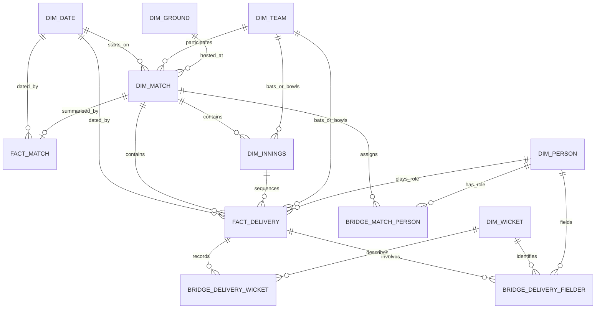
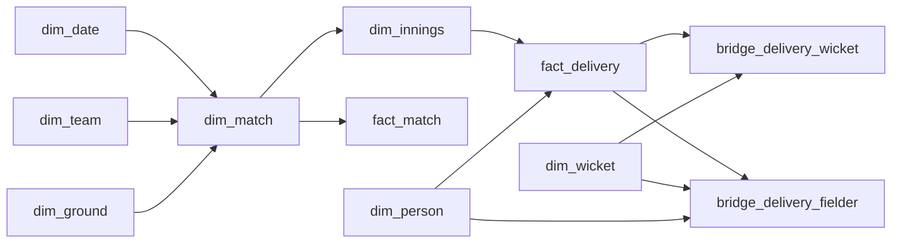
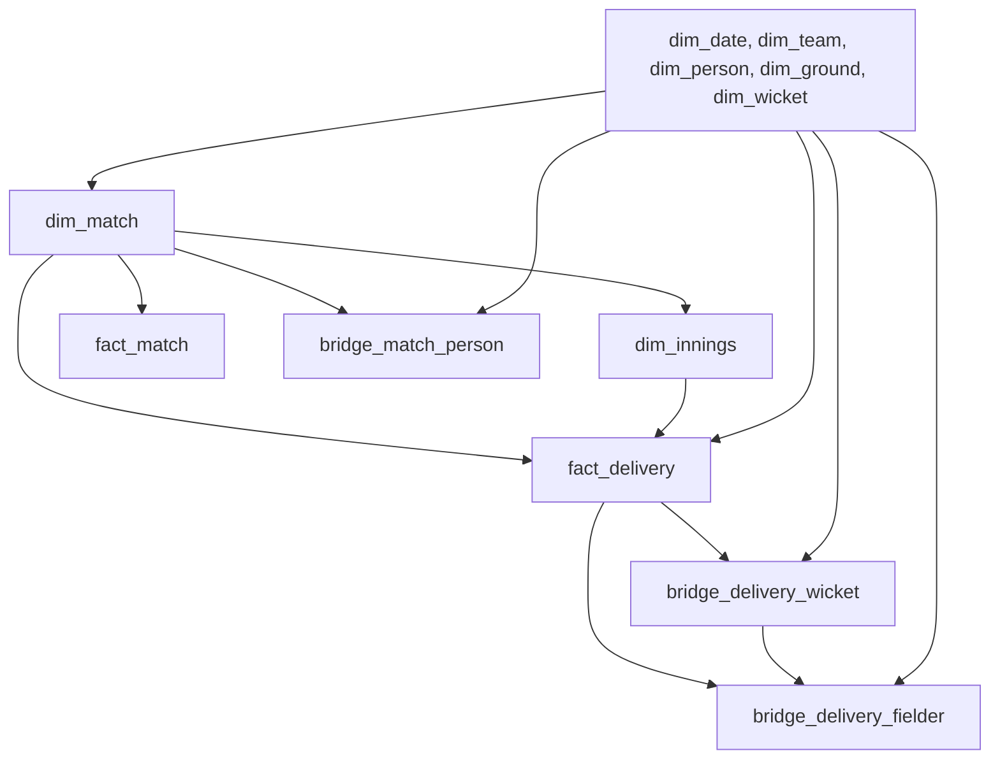

# Cricket warehouse database

## Scope

This document describes the warehouse schema created by the dialect-specific
migrations in `bb-update-database/migrations/{mysql,postgres,sqlite}`.

The MySQL and PostgreSQL migrations create the dimensional warehouse in the
`cricsheet` database/schema. SQLite stores the same tables in its `main`
database. Each migration defines the schema only; source parsing, dimension
population, surrogate-key allocation, and role-code standardisation are
responsibilities of the loading application.

The model is designed for analytical queries over cricket matches and
deliveries:

- Dimensions provide descriptive, reusable entities such as dates, teams,
  people, grounds, matches, innings, and wicket types.
- Facts store measurements at a declared grain: one row per match or one row
  per delivery.
- Factless bridges represent many-to-many or role-based relationships without
  duplicating fact rows.
- Source identifiers remain on dimensions and facts where applicable so ETL
  can reconcile warehouse rows with the original source data.

## Schema at a glance

The `DIM_TEAM` relationships to `DIM_MATCH`, `DIM_INNINGS`, and
`FACT_DELIVERY` represent several named foreign keys rather than one generic
relationship. For example, a match has separate team keys for team one, team
two, the toss team, the winner, and the loser.

### Table inventory

| Table | Type | Grain | Primary key |
| --- | --- | --- | --- |
| `dim_date` | Dimension | One row per calendar date | `date_key` |
| `dim_team` | Dimension | One row per source team | `team_key` |
| `dim_person` | Dimension | One row per source person | `person_key` |
| `dim_ground` | Dimension | One row per source ground | `ground_key` |
| `dim_match` | Dimension | One row per source match | `match_key` |
| `dim_innings` | Helper dimension | One row per innings in a match | `innings_key` |
| `dim_wicket` | Dimension | One row per source wicket type/identifier | `wicket_key` |
| `fact_match` | Fact | One row per warehouse match | `match_key` |
| `fact_delivery` | Fact | One row per source `BallByBall` delivery | `delivery_key` |
| `bridge_match_person` | Factless bridge | One row per match/person/role assignment | `match_person_key` |
| `bridge_delivery_wicket` | Factless bridge | One row per delivery/wicket association | (`delivery_key`, `wicket_key`) |
| `bridge_delivery_fielder` | Factless bridge | One row per delivery/wicket/fielder association | (`delivery_key`, `wicket_key`, `person_key`) |

## Key conventions

### Surrogate and source keys

Most dimensions use an auto-incrementing 64-bit surrogate key. The exact DDL
representation is dialect-specific: MySQL uses `BIGINT UNSIGNED`, PostgreSQL
uses `BIGINT GENERATED BY DEFAULT AS IDENTITY`, and SQLite uses
`INTEGER PRIMARY KEY AUTOINCREMENT`. The surrogate key is used by warehouse
foreign keys, while the source identifier is kept separately and protected by
a unique constraint:

| Dimension | Warehouse key | Source identifier |
| --- | --- | --- |
| `dim_team` | `team_key` | `source_team_id` |
| `dim_person` | `person_key` | `source_person_id` |
| `dim_ground` | `ground_key` | `source_ground_id` |
| `dim_match` | `match_key` | `source_match_id` |
| `dim_wicket` | `wicket_key` | `source_wicket_id` |

`dim_date` is keyed by the integer `date_key`, which is also the key used by
date foreign keys. `fact_match` deliberately uses `match_key` as both its
primary key and its foreign key to `dim_match`, making it a one-to-zero-or-one
extension of the match dimension.

### Foreign-key behavior

The MySQL tables use InnoDB. PostgreSQL and SQLite use their native
transactional DDL; SQLite migrations enable `PRAGMA foreign_keys = ON`. The
warehouse migration declares referential constraints but does not specify
`ON DELETE` or `ON UPDATE` actions. The database therefore applies its default
restrictive behavior rather than cascading deletes. Parent rows must be
available before dependent rows are loaded.

### Nullable relationships

The following values are intentionally nullable because the source may not
provide them for every match or delivery:

- `dim_match.source_ca_id`
- `dim_match.match_start_date_key`
- `dim_match.toss_decision`
- `dim_match.winner_team_key`
- `dim_match.loser_team_key`
- `fact_match.match_date_key`
- `fact_delivery.match_date_key`
- `fact_delivery.non_boundary`
- `dim_wicket.wicket_kind`

The nullable date foreign keys allow a match or delivery to remain represented
when a usable start date is unavailable. The dimension date row itself is
fully populated and has a unique natural date in `calendar_date`.

## Dimensions

### `dim_date`

`dim_date` is the conformed calendar dimension. The ETL process must populate
it before loading facts that reference it.

| Column | Type | Null | Description |
| --- | --- | --- | --- |
| `date_key` | `INT` | No | Warehouse date key and primary key. |
| `calendar_date` | `DATE` | No | Calendar date; unique. |
| `calendar_year` | `SMALLINT` | No | Calendar year. |
| `calendar_quarter` | `TINYINT` | No | Quarter number. |
| `calendar_month` | `TINYINT` | No | Month number. |
| `month_name` | `VARCHAR(9)` | No | Month display name. |
| `week_of_year` | `TINYINT` | No | Week number within the year. |
| `day_of_month` | `TINYINT` | No | Day number within the month. |
| `day_of_week` | `TINYINT` | No | Day number within the week. |
| `day_name` | `VARCHAR(9)` | No | Day display name. |
| `is_weekend` | `BOOLEAN` | No | Whether the date falls on a weekend. |

Indexes and constraints:

- Primary key: `date_key`.
- Unique key: `uq_dim_date_calendar_date` on `calendar_date`.

### `dim_team`

`dim_team` is a Type 1 team dimension. It stores the current descriptive team
name for each source team and is reused by match, innings, and delivery rows.

| Column | Type | Null | Description |
| --- | --- | --- | --- |
| `team_key` | `BIGINT UNSIGNED` | No | Auto-incrementing warehouse key and primary key. |
| `source_team_id` | `INT` | No | Source team identifier; unique. |
| `team_name` | `VARCHAR(100)` | No | Team name. |

Indexes and constraints:

- Unique key: `uq_dim_team_source_id` on `source_team_id`.
- Secondary index: `idx_dim_team_name` on `team_name`.

### `dim_person`

`dim_person` is shared by players and match-official roles. The role a person
plays in a particular match is not encoded as separate person dimensions; it
is recorded in `bridge_match_person.role_code`.

| Column | Type | Null | Description |
| --- | --- | --- | --- |
| `person_key` | `BIGINT UNSIGNED` | No | Auto-incrementing warehouse key and primary key. |
| `source_person_id` | `VARCHAR(10)` | No | Source person identifier; unique. |
| `full_name` | `VARCHAR(200)` | No | Full display name. |
| `sort_name_part` | `VARCHAR(200)` | No | Name component used for sorting. |
| `other_name_part` | `VARCHAR(200)` | No | Remaining name component. |
| `ca_id` | `INT` | No | Cricket archive/source identifier. |

Indexes and constraints:

- Unique key: `uq_dim_person_source_id` on `source_person_id`.
- Secondary indexes: `idx_dim_person_sort_name` and `idx_dim_person_ca_id`.

### `dim_ground`

`dim_ground` stores the source ground associated with matches.

| Column | Type | Null | Description |
| --- | --- | --- | --- |
| `ground_key` | `BIGINT UNSIGNED` | No | Auto-incrementing warehouse key and primary key. |
| `source_ground_id` | `INT` | No | Source ground identifier; unique. |
| `ground_name` | `VARCHAR(500)` | No | Ground name. |

Indexes and constraints:

- Unique key: `uq_dim_ground_source_id` on `source_ground_id`.
- Secondary index: `idx_dim_ground_name` on `ground_name`.

### `dim_match`

`dim_match` contains one row per source match. It holds match descriptors and
the dimension keys shared by match-level and delivery-level analysis.

| Column | Type | Null | Description |
| --- | --- | --- | --- |
| `match_key` | `BIGINT UNSIGNED` | No | Auto-incrementing warehouse key and primary key. |
| `source_match_id` | `INT` | No | Source match identifier; unique. |
| `source_ca_id` | `VARCHAR(10)` | Yes | Optional source/Cricket Archive identifier. |
| `file_name` | `VARCHAR(120)` | No | Source file name. |
| `match_in_series` | `INT` | No | Match position within a series. |
| `match_type` | `VARCHAR(15)` | No | Match format/type. |
| `event_name` | `VARCHAR(200)` | No | Competition or event name. |
| `match_date_text` | `VARCHAR(200)` | No | Original source date text. |
| `season` | `VARCHAR(200)` | No | Source season value. |
| `match_start_year` | `VARCHAR(200)` | No | Source start-year value. |
| `match_start_date_key` | `INT` | Yes | Foreign key to `dim_date.date_key`. |
| `balls_per_over` | `INT` | No | Number of balls in an over. |
| `added_timestamp` | `DATETIME` | No | Time the match was added. |
| `team1_key` | `BIGINT UNSIGNED` | No | First participating team. |
| `team2_key` | `BIGINT UNSIGNED` | No | Second participating team. |
| `ground_key` | `BIGINT UNSIGNED` | No | Match ground. |
| `toss_team_key` | `BIGINT UNSIGNED` | No | Team winning the toss. |
| `toss_decision` | `VARCHAR(10)` | Yes | Decision after winning the toss. |
| `victory_type` | `VARCHAR(15)` | No | Result/victory type. |
| `winner_team_key` | `BIGINT UNSIGNED` | Yes | Winning team, when there is one. |
| `loser_team_key` | `BIGINT UNSIGNED` | Yes | Losing team, when there is one. |

Foreign keys:

- `match_start_date_key` references `dim_date(date_key)`.
- `team1_key`, `team2_key`, `toss_team_key`, `winner_team_key`, and
  `loser_team_key` reference `dim_team(team_key)`.
- `ground_key` references `dim_ground(ground_key)`.

Indexes include match type, season, start date, both participating teams, and
ground. The source match identifier is unique, making it suitable for
idempotent source-match detection.

### `dim_innings`

`dim_innings` is a helper dimension at innings grain. It centralises the
match-to-batting-team and match-to-bowling-team relationship so delivery
queries do not need to reconstruct it for every row.

| Column | Type | Null | Description |
| --- | --- | --- | --- |
| `innings_key` | `BIGINT UNSIGNED` | No | Auto-incrementing warehouse key and primary key. |
| `match_key` | `BIGINT UNSIGNED` | No | Parent match. |
| `innings_number` | `INT` | No | Number/order of the innings within the match. |
| `batting_team_key` | `BIGINT UNSIGNED` | No | Team batting in the innings. |
| `bowling_team_key` | `BIGINT UNSIGNED` | No | Team bowling in the innings. |

Indexes and constraints:

- Unique key: `uq_dim_innings_match_number` on (`match_key`,
  `innings_number`).
- `match_key` references `dim_match(match_key)`.
- `batting_team_key` and `bowling_team_key` reference `dim_team(team_key)`.
- Secondary indexes support both team roles.

### `dim_wicket`

`dim_wicket` describes source wicket identifiers. A separate dimension is
used because a delivery can be associated with more than one wicket.

| Column | Type | Null | Description |
| --- | --- | --- | --- |
| `wicket_key` | `BIGINT UNSIGNED` | No | Auto-incrementing warehouse key and primary key. |
| `source_wicket_id` | `INT` | No | Source wicket identifier; unique. |
| `wicket_kind` | `VARCHAR(30)` | Yes | Wicket kind/type. |

Indexes and constraints:

- Unique key: `uq_dim_wicket_source_id` on `source_wicket_id`.
- Secondary index: `idx_dim_wicket_kind` on `wicket_kind`.

## Facts

### `fact_match`

`fact_match` has one row per source match. Its primary key is also a foreign
key to `dim_match`, so it stores match-level measures without copying the
match descriptor columns into the fact. The source JSON filename is retained
as a directly queryable provenance attribute.

| Column | Type | Null | Description |
| --- | --- | --- | --- |
| `match_key` | `BIGINT UNSIGNED` | No | Primary key and foreign key to `dim_match`. |
| `file_name` | `VARCHAR(120)` | No | Filename of the source JSON match file. |
| `match_date_key` | `INT` | Yes | Optional foreign key to `dim_date`. |
| `ground_key` | `BIGINT UNSIGNED` | No | Foreign key to `dim_ground`. |
| `duration_days` | `INT` | No | Match duration in days. |
| `margin` | `INT` | No | Match result margin. |
| `match_count` | `TINYINT UNSIGNED` | No | Additive count measure; defaults to `1`. |

The fact also indexes `match_date_key` and `ground_key` for common analytical
filters. The filename is copied from `dim_match.file_name` when a match fact is
created and is part of the initial warehouse schema.

### `fact_delivery`

`fact_delivery` is the most granular fact. Each row represents one delivery in
the source `BallByBall` table. Measures and role keys are stored at this grain;
wicket and fielder associations are kept in `bridge_delivery_wicket` and
`bridge_delivery_fielder`.

| Column | Type | Null | Description |
| --- | --- | --- | --- |
| `delivery_key` | `BIGINT UNSIGNED` | No | Auto-incrementing warehouse key and primary key. |
| `source_ball_id` | `INT` | No | Source delivery identifier; unique. |
| `match_key` | `BIGINT UNSIGNED` | No | Parent match. |
| `match_date_key` | `INT` | Yes | Optional delivery date. |
| `innings_key` | `BIGINT UNSIGNED` | No | Parent innings. |
| `batting_team_key` | `BIGINT UNSIGNED` | No | Batting team at delivery time. |
| `bowling_team_key` | `BIGINT UNSIGNED` | No | Bowling team at delivery time. |
| `batter_key` | `BIGINT UNSIGNED` | No | Batter. |
| `non_striker_key` | `BIGINT UNSIGNED` | No | Non-striker. |
| `bowler_key` | `BIGINT UNSIGNED` | No | Bowler. |
| `over_number` | `INT` | No | Over number. |
| `ball_number` | `INT` | No | Source/innings ball number. |
| `ball_in_over` | `INT` | No | Ball position within the over. |
| `innings_order` | `INT` | No | Delivery order within the innings. |
| `batter_runs` | `INT` | No | Runs credited to the batter. |
| `extra_runs` | `INT` | No | Total extras on the delivery. |
| `total_runs` | `INT` | No | Total runs from the delivery. |
| `no_balls` | `INT` | No | No-ball runs/count. |
| `wides` | `INT` | No | Wide runs/count. |
| `byes` | `INT` | No | Bye runs/count. |
| `leg_byes` | `INT` | No | Leg-bye runs/count. |
| `non_boundary` | `INT` | Yes | Optional non-boundary indicator/value. |
| `powerplay` | `INT` | No | Powerplay indicator/value. |
| `wicket_count` | `INT` | No | Number of wickets on the delivery. |

Foreign keys:

- `match_key` references `dim_match(match_key)`.
- `match_date_key` references `dim_date(date_key)`.
- `innings_key` references `dim_innings(innings_key)`.
- `batting_team_key` and `bowling_team_key` reference `dim_team(team_key)`.
- `batter_key`, `non_striker_key`, and `bowler_key` reference
  `dim_person(person_key)`.

Indexes support match-order scans, date and innings filtering, team and player
analysis, over filtering, and powerplay filtering. `source_ball_id` is unique
for source-level deduplication.

## Factless bridges

### `bridge_match_person`

This bridge records match participation and official assignments. The same
person can have multiple role rows in one match, but the same
match/person/role combination cannot be inserted twice.

| Column | Type | Null | Description |
| --- | --- | --- | --- |
| `match_person_key` | `BIGINT UNSIGNED` | No | Auto-incrementing bridge key and primary key. |
| `match_key` | `BIGINT UNSIGNED` | No | Foreign key to `dim_match`. |
| `person_key` | `BIGINT UNSIGNED` | No | Foreign key to `dim_person`. |
| `role_code` | `VARCHAR(32)` | No | Application-defined role code. |

The unique key `uq_bridge_match_person_role` covers (`match_key`,
`person_key`, `role_code`). Secondary indexes support person and role lookups.
The migration does not define an allowed-value catalogue for `role_code`; role
standardisation remains an application concern.

### `bridge_delivery_wicket`

This bridge supports the one-to-many relationship between a delivery and its
wickets. It prevents multiple wicket associations from requiring duplicate
delivery fact rows.

| Column | Type | Null | Description |
| --- | --- | --- | --- |
| `delivery_key` | `BIGINT UNSIGNED` | No | Foreign key to `fact_delivery`. |
| `wicket_key` | `BIGINT UNSIGNED` | No | Foreign key to `dim_wicket`. |

The composite primary key (`delivery_key`, `wicket_key`) prevents duplicate
associations. Both columns are also foreign keys, so a bridge row cannot exist
without its delivery and wicket dimension row.

### `bridge_delivery_fielder`

This bridge records the people named in a wicket's Cricsheet `fielders` array.
The wicket key is retained in addition to the delivery key so a fielder remains
attached to the specific wicket when a delivery contains more than one wicket.

| Column | Type | Null | Description |
| --- | --- | --- | --- |
| `delivery_key` | `BIGINT UNSIGNED` | No | Foreign key to `fact_delivery`. |
| `wicket_key` | `BIGINT UNSIGNED` | No | Foreign key to `dim_wicket`. |
| `person_key` | `BIGINT UNSIGNED` | No | Foreign key to the fielding person in `dim_person`. |

The composite primary key (`delivery_key`, `wicket_key`, `person_key`) prevents
duplicate fielder associations. The person index supports queries such as
fielding dismissals by player.

## Relationship and query paths

### Match and delivery analysis

Typical analytical paths are:

1. Match summary: `fact_match` → `dim_match` → `dim_date`, `dim_team`, and
   `dim_ground`.
2. Innings summary: `fact_delivery` → `dim_innings` → `dim_match`, with
   `batting_team_key` and `bowling_team_key` identifying the innings teams.
3. Player analysis: `fact_delivery` → `dim_person` through `batter_key`,
   `non_striker_key`, or `bowler_key`.
4. Match personnel: `dim_match` → `bridge_match_person` → `dim_person`,
   filtered by `role_code`.
5. Wicket analysis: `fact_delivery` → `bridge_delivery_wicket` →
   `dim_wicket`.
6. Fielding analysis: `fact_delivery` → `bridge_delivery_fielder` →
   `dim_person`, optionally joined through `wicket_key` to `dim_wicket`.

When joining `fact_delivery` to teams or people, use the role-specific foreign
key that matches the question. Joining all three person keys as though they
were one relationship will multiply rows and produce incorrect aggregates.

## Loading order

The foreign keys imply the following parent-before-child order:

For bulk output, the practical sequence is:

1. Populate `dim_date`, `dim_team`, `dim_person`, `dim_ground`, and
   `dim_wicket`.
2. Populate `dim_match` after its referenced date, team, and ground rows are
   present.
3. Populate `dim_innings`.
4. Populate `fact_match` with the source filename copied from `dim_match`, and
   populate `fact_delivery`.
5. Populate `bridge_match_person` and `bridge_delivery_wicket` after their
   parent rows exist.
6. Populate `bridge_delivery_fielder` after its delivery, wicket, and person
   parent rows exist.

The application’s CSV loader follows this order. Optional files may be absent
when the source data contains no rows for a table. CSV output should be loaded
into a new or explicitly coordinated warehouse because the generated files
contain the warehouse keys allocated by the output adapter.

## Output adapter architecture

The parser depends on the dialect-neutral `OutputAdapter` contract. Adapter
implementations are grouped under
`bb-update-database/src/main/kotlin/com/knowledgespike/ballbyball/parse/database/adapter`:

| Package | Responsibility |
| --- | --- |
| `adapter.mariadb` | MariaDB direct JDBC and SQL-file output using `ON DUPLICATE KEY UPDATE`. |
| `adapter.postgres` | PostgreSQL direct JDBC and SQL-file output using `ON CONFLICT`. |
| `adapter.sqlite` | SQLite direct JDBC and SQL-file output using `ON CONFLICT` and SQLite identity columns. |
| `adapter.csv` | Dialect-independent CSV files with warehouse-compatible column order. |

The shared JDBC implementation contains warehouse upsert and insert behavior;
the dialect-specific direct adapters provide conflict syntax and connection
initialisation. Direct JDBC output selects an adapter from the connection URL.
SQL-file output selects the dialect with `--database`, defaulting to MariaDB.
Each SQL-file adapter emits a destructive warehouse reset, dialect-specific DDL,
and a transaction around generated rows.

## Operational notes

- Run Flyway migrations `1__initial_tables.sql` and
  `2__initial_warehouse.sql` for the selected dialect before loading warehouse
  data. The initial warehouse migration includes `fact_match.file_name`.
- The migration creates tables but does not insert dimension or fact data.
- The database schema is named `cricsheet` by the migration.
- MySQL warehouse tables use `ENGINE = InnoDB`; PostgreSQL and SQLite use their
  native table storage.
- Keep `2__initial_warehouse.sql` and generated SQL-file schema definitions in
  sync when the warehouse changes; the SQL-file adapter recreates this schema
  for destructive offline replacement loads.
- Keep the shared `WarehouseSchemaSql` definitions aligned with all three
  warehouse migrations when a table, index, key, or constraint changes.
- Source identifiers are not foreign keys to the original operational tables;
  they are traceability attributes. Warehouse relationships use the surrogate
  keys defined above.

## Source of truth

The authoritative DDL for this document is the matching
`2__initial_warehouse.sql` in the selected dialect directory:

- `bb-update-database/migrations/mysql/2__initial_warehouse.sql`
- `bb-update-database/migrations/postgres/2__initial_warehouse.sql`
- `bb-update-database/migrations/sqlite/2__initial_warehouse.sql`