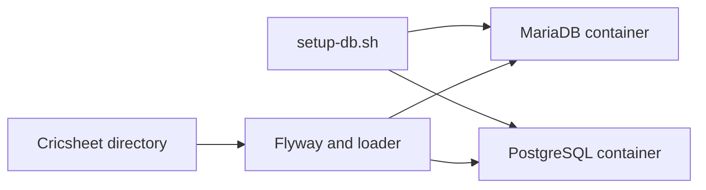

# MariaDB and PostgreSQL test environments

This guide creates two independent, reproducible Docker test environments for
the `DataLoader` project:



The supplied script is the canonical workflow. It creates containers with
named volumes, creates the application users and databases, applies the
dialect-specific Flyway migrations, and loads the same Cricsheet input into
both databases.

## Prerequisites

Install or make available:

- Docker Desktop or a Docker Engine with the `docker` command available.
- Java 21, as required by the Gradle toolchain.
- The repository checkout, including `gradlew`.
- A Cricsheet data directory containing the scorecard directories used by the
  parser and the player registry CSV, normally `people.csv`.

Run all commands from the repository root unless a command says otherwise.

The script uses these local-only defaults:

| Setting          | MariaDB                   | PostgreSQL                 |
|------------------|---------------------------|----------------------------|
| Image            | `mariadb:12.3.2`          | `postgres:17.6`            |
| Container        | `dataloader-mariadb`      | `dataloader-postgres`      |
| Host port        | `3307`                    | `5433`                     |
| Database         | `cricsheet`               | `cricsheet`                |
| Application user | `cricsheet`               | `cricsheet`                |
| Data volume      | `dataloader-mariadb-data` | `dataloader-postgres-data` |

The default passwords are intentionally suitable only for a local disposable
test environment. Override them before sharing the environment or exposing a
database outside the local machine.

## Reproducible setup using the script

The script is stored at `docs/setup/setup-db.sh`. Make it executable once:

```bash
chmod +x docs/setup/setup-db.sh
```

Set the source data location. `PLAYER_REGISTRY` is relative to
`CRICSHEET_DIR`:

```bash
export CRICSHEET_DIR=/path/to/cricsheet
export PLAYER_REGISTRY=people.csv
```

Create both containers, create their users and databases, apply both migration
sets, and populate both databases:

```bash
docs/setup/setup-db.sh all
```

The `all` command is safe to rerun. Existing containers are started, existing
application credentials are reset to the configured values, Flyway skips
already-applied migrations, and the loader uses the existing database adapter
behavior. The loader's normal database semantics apply when importing into an
already-populated database.

Run individual phases when troubleshooting or when the databases should remain
empty:

```bash
# Start containers and create users/databases.
docs/setup/setup-db.sh up

# Apply the schema without loading Cricsheet data.
docs/setup/setup-db.sh migrate

# Load Cricsheet data into both already-migrated databases.
docs/setup/setup-db.sh load

# Stop containers but retain their named volumes.
docs/setup/setup-db.sh down

# Show container state.
docs/setup/setup-db.sh status
```

To start completely fresh, remove the containers and their volumes. This is
destructive and requires an explicit confirmation variable:

```bash
CONFIRM_RESET=1 docs/setup/setup-db.sh reset
docs/setup/setup-db.sh all
```

## Configuration overrides

All configuration is supplied through environment variables so the script does
not need to be edited. The most useful variables are:

| Variable                  | Default                    | Purpose                               |
|---------------------------|----------------------------|---------------------------------------|
| `MARIADB_IMAGE`           | `mariadb:12.3.2`           | MariaDB image tag                     |
| `POSTGRES_IMAGE`          | `postgres:17.6`            | PostgreSQL image tag                  |
| `MARIADB_CONTAINER`       | `dataloader-mariadb`       | MariaDB container name                |
| `POSTGRES_CONTAINER`      | `dataloader-postgres`      | PostgreSQL container name             |
| `MARIADB_PORT`            | `3307`                     | Host port mapped to MariaDB `3306`    |
| `POSTGRES_PORT`           | `5433`                     | Host port mapped to PostgreSQL `5432` |
| `MARIADB_DATABASE`        | `cricsheet`                | MariaDB database name                 |
| `POSTGRES_DATABASE`       | `cricsheet`                | PostgreSQL database name              |
| `MARIADB_USER`            | `cricsheet`                | MariaDB application user              |
| `POSTGRES_USER`           | `cricsheet`                | PostgreSQL application user           |
| `MARIADB_PASSWORD`        | local default              | MariaDB application password          |
| `POSTGRES_PASSWORD`       | local default              | PostgreSQL application password       |
| `MARIADB_ROOT_PASSWORD`   | local default              | MariaDB administrative password       |
| `POSTGRES_ADMIN_PASSWORD` | local default              | PostgreSQL `postgres` password        |
| `MARIADB_VOLUME`          | `dataloader-mariadb-data`  | MariaDB Docker volume                 |
| `POSTGRES_VOLUME`         | `dataloader-postgres-data` | PostgreSQL Docker volume              |

For example, use alternate ports and credentials when the defaults are already
occupied:

```bash
export MARIADB_PORT=13307
export POSTGRES_PORT=15433
export MARIADB_PASSWORD='local-mariadb-password'
export POSTGRES_PASSWORD='local-postgres-password'
export MARIADB_ROOT_PASSWORD='local-mariadb-root-password'
export POSTGRES_ADMIN_PASSWORD='local-postgres-admin-password'
docs/setup/setup-db.sh all
```

Database and user names must contain only letters, numbers, and underscores.
The script rejects passwords containing quotes, backslashes, or newlines because
the setup SQL is sent directly to the database clients inside the containers.

Container image, port, volume, and administrative-password settings are applied
when a container or volume is first created. If those settings change for an
existing environment, run `CONFIRM_RESET=1 docs/setup/setup-db.sh reset` before
running `up` or `all` again.

## What the script does

### 1. Create and start MariaDB

The script runs the equivalent of:

```bash
docker run --detach \
  --name dataloader-mariadb \
  --restart unless-stopped \
  --publish 3307:3306 \
  --volume dataloader-mariadb-data:/var/lib/mysql \
  --env MARIADB_ROOT_PASSWORD="$MARIADB_ROOT_PASSWORD" \
  mariadb:12.3.2
```

It waits for `mariadb-admin ping` to succeed before continuing. The data is
stored in `dataloader-mariadb-data`, so stopping or recreating the container
does not remove the database.

Inside the container, it executes the following idempotent setup as `root`:

```sql
CREATE DATABASE IF NOT EXISTS `cricsheet`
    CHARACTER SET utf8mb4
    COLLATE utf8mb4_unicode_ci;
CREATE USER IF NOT EXISTS 'cricsheet'@'%' IDENTIFIED BY 'local-password';
ALTER USER 'cricsheet'@'%' IDENTIFIED BY 'local-password';
GRANT ALL PRIVILEGES ON `cricsheet`.* TO 'cricsheet'@'%';
FLUSH PRIVILEGES;
```

The application can therefore connect through the host with:

```text
jdbc:mariadb://127.0.0.1:3307/cricsheet
```

### 2. Create and start PostgreSQL

The script runs the equivalent of:

```bash
docker run --detach \
  --name dataloader-postgres \
  --restart unless-stopped \
  --publish 5433:5432 \
  --volume dataloader-postgres-data:/var/lib/postgresql/data \
  --env POSTGRES_USER=postgres \
  --env POSTGRES_PASSWORD="$POSTGRES_ADMIN_PASSWORD" \
  --env POSTGRES_DB=postgres \
  postgres:17.6
```

It waits for `pg_isready` to succeed. It then connects as the administrative
`postgres` user and creates or updates the application role and database:

```sql
CREATE ROLE cricsheet LOGIN PASSWORD 'local-password';
ALTER
ROLE cricsheet WITH LOGIN PASSWORD 'local-password';
CREATE DATABASE cricsheet OWNER cricsheet;
ALTER DATABASE cricsheet OWNER TO cricsheet;
GRANT ALL PRIVILEGES ON DATABASE cricsheet TO cricsheet;
```

The actual script uses PostgreSQL identifier and literal quoting so configured
names are not interpolated as raw SQL. The application can connect through the
host with:

```text
jdbc:postgresql://127.0.0.1:5433/cricsheet
```

### 3. Apply migrations

`migrate` invokes the existing Gradle Flyway task twice. MariaDB selects the
`mysql` migration directory because the project retains that directory name
for MariaDB compatibility:

```bash
FLYWAY_DATABASE=mysql \
FLYWAY_URL=jdbc:mariadb://127.0.0.1:3307/cricsheet \
FLYWAY_USER=cricsheet \
FLYWAY_PASSWORD="$MARIADB_PASSWORD" \
./gradlew :bb-update-database:flywayMigrate --no-daemon
```

PostgreSQL selects its own migration directory:

```bash
FLYWAY_DATABASE=postgres \
FLYWAY_URL=jdbc:postgresql://127.0.0.1:5433/cricsheet \
FLYWAY_USER=cricsheet \
FLYWAY_PASSWORD="$POSTGRES_PASSWORD" \
./gradlew :bb-update-database:flywayMigrate --no-daemon
```

Each target receives `1__initial_tables.sql` and the complete
`2__initial_warehouse.sql`, including the non-null `fact_match.file_name`
column. The PostgreSQL migrations create and use the `cricsheet` schema; the
MariaDB migrations use the `cricsheet` database.

### 4. Populate both databases

The `load` command calls the existing application twice with `DATABASE`
output. It selects the adapter from the JDBC URL, so MariaDB uses the MariaDB
adapter and PostgreSQL uses the PostgreSQL adapter:

```bash
./gradlew :bb-update-database:run --no-daemon \
  --args="--outputType DATABASE \
    --baseDirectory $CRICSHEET_DIR \
    --playerRegistry $PLAYER_REGISTRY \
    --connectionString jdbc:mariadb://127.0.0.1:3307/cricsheet \
    --userName cricsheet \
    --password $MARIADB_PASSWORD"
```

The PostgreSQL invocation is the same except for the PostgreSQL JDBC URL and
password:

```bash
./gradlew :bb-update-database:run --no-daemon \
  --args="--outputType DATABASE \
    --baseDirectory $CRICSHEET_DIR \
    --playerRegistry $PLAYER_REGISTRY \
    --connectionString jdbc:postgresql://127.0.0.1:5433/cricsheet \
    --userName cricsheet \
    --password $POSTGRES_PASSWORD"
```

The script passes the same source directory and registry to both commands. It
does not copy the source data into either container; the Gradle process writes
through JDBC, which keeps the two database loads identical and avoids adding a
large source-data volume to Docker.

## Verify the environments

Check the containers:

```bash
docs/setup/setup-db.sh status
```

Check MariaDB connectivity and table creation:

```bash
docker exec dataloader-mariadb mariadb \
  --user=cricsheet \
  --password="$MARIADB_PASSWORD" \
  --database=cricsheet \
  --execute='SHOW TABLES;'
```

Check PostgreSQL connectivity and table creation:

```bash
docker exec dataloader-postgres psql \
  --username=cricsheet \
  --dbname=cricsheet \
  --command='SELECT table_schema, table_name FROM information_schema.tables WHERE table_schema = '\''cricsheet'\'' ORDER BY table_name;'
```

After a successful load, compare row counts for the important warehouse
tables. The exact counts depend on the selected Cricsheet input, but the
corresponding counts should agree between the two databases:

```bash
docker exec dataloader-mariadb mariadb \
  --user=cricsheet --password="$MARIADB_PASSWORD" --database=cricsheet \
  --execute='SELECT "dim_match" AS table_name, COUNT(*) AS row_count FROM dim_match UNION ALL SELECT "fact_delivery", COUNT(*) FROM fact_delivery;'

docker exec dataloader-postgres psql \
  --username=cricsheet --dbname=cricsheet \
  --command='SELECT '\''dim_match'\'' AS table_name, COUNT(*) AS row_count FROM cricsheet.dim_match UNION ALL SELECT '\''fact_delivery'\'', COUNT(*) FROM cricsheet.fact_delivery;'
```

## Manual container access

Use these commands when inspecting a failed setup without changing the
environment:

```bash
docker logs dataloader-mariadb
docker logs dataloader-postgres
docker exec -it dataloader-mariadb mariadb --user=root --password="$MARIADB_ROOT_PASSWORD"
docker exec -it dataloader-postgres psql --username=postgres --dbname=postgres
```

The application connection details are:

| Database   | JDBC URL                                     | User        |
|------------|----------------------------------------------|-------------|
| MariaDB    | `jdbc:mariadb://127.0.0.1:3307/cricsheet`    | `cricsheet` |
| PostgreSQL | `jdbc:postgresql://127.0.0.1:5433/cricsheet` | `cricsheet` |

## Lifecycle and data reset

- `down` stops containers and preserves both named volumes.
- `up` starts existing containers and reapplies the application credentials.
- `migrate` is safe to rerun because Flyway tracks applied migrations.
- `load` is intended for test data loading and follows the adapters documented
  in `README-DEV.md`.
- `reset` removes both containers and both named volumes. It is the only
  command that deletes database data and requires `CONFIRM_RESET=1`.

Do not commit production credentials, generated dumps, or Cricsheet source data
to the repository. The script's passwords are local defaults and should be
overridden for any shared or non-disposable environment.

## Related documentation

- `README-DEV.md` — parser, adapter, migration, and output-mode reference.
- `docs/architecture/database.md` — warehouse tables, relationships, grains,
  and loading order.
- `bb-update-database/migrations/mysql` — MariaDB-compatible migrations.
- `bb-update-database/migrations/postgres` — PostgreSQL migrations.